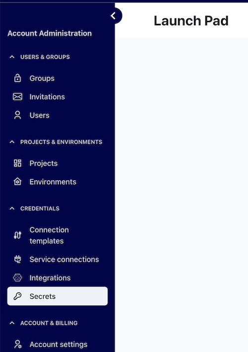
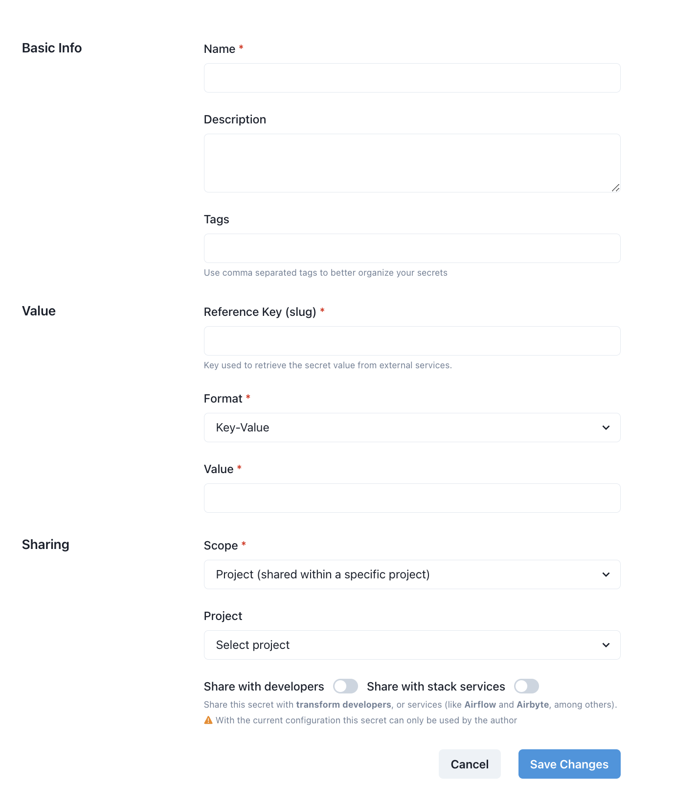

# How to Create/Edit a Secret

Navigate to the Secrets Menu

To create a new secret click the `New Secret` button.

 

### A Secret consists of the following fields:

#### Basic Info

- **Name** This is the name used to identify the secret in the system, note that this is not the ID you'd use to retrieve the secret's value.
- **Description** The description that could help you understand the secret's context.
- **Tags** Comma separated keywords used to better organize your secrets. 

#### Value

- **Reference key** This is the Unique ID of the secret, used to retrieve its value from external tools
- **Format** This defines the secret format, it could be one of:

  - **Key-Value** A plain string value
  - **Multiple Key-Value pairs** This format allows storing multiple key-value pairs, useful for connections, i.e. `username=value,password=value`
  - **Raw JSON**: This format allows storing more complex structures, using JSON. [Learn more here](https://www.w3schools.com/js/js_json_intro.asp).

- **Value** This is the actual value of the secret, depending on the __format__ you provided earlier, the input could be slightly different

#### Sharing

- **Scope** This is the sharing scope of the secret, it could be either project or environment
- **Project** If the chosen __scope__ was project, select a project in this dropdown box
- **Environment** If the chosen __scope__ was environment, select an environment in this dropdown box
- **Share with developers** If enabled, this secret can be used by transform developers on the selected project or environment
- **Share with services** If enabled, this secret can be used by any service running on the selected project or environment

>[!NOTE] If the secret isn’t shared with the developers or services, only the author can use it.
