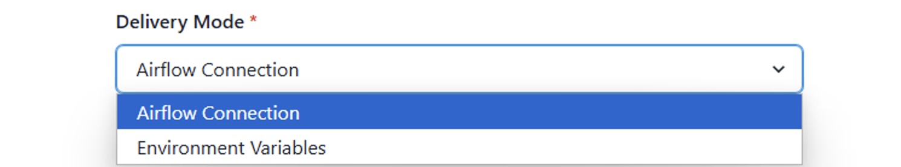

# How to Create/Edit a Service Connection

Navigate to the Service Connection page

To create a new Service Connection click the `New Connection` button.

Select the environment you wish to configure.

A Service Connection consists of the following fields:

- **Name** Defines how the connection will be referred to by the automated service. Should be called `main` and will be included in the name of the environment variables seen below.
- **Environment** The Datacoves environment associated with this service connection.
- **Service** The Datacoves stack service where this connection should be made available e.g. Airflow
- **Delivery Mode** Datacoves currently supports 2 Delivery modes
  - **Airflow Connection** (preferred method) This method will create a connection entry in Airlfow using the credentials you configure which will allow you to make use of the custom [Airflow Decorators](/reference/airflow/datacoves-decorators.md) by passing the `Name` of the connection you created as the `connection_id`. 
  - **Environment Variables** The original method Datacoves used to inject the connection credentials as environment variables in Airflow. The name of the service connection will be used to dynamically create [environment variables](/reference/airflow/environment-service-connection-vars.md) which we inject into Airflow. 
    . 
- **Connection Template** The connection template to base this service connection on(i.e. the defaults)
  Depending on the template selected, additional fields will be displayed with the default values entered in the connection template. These default values can be overridden by toggling the indicator next to the given value. Enter the appropriate user, schema, and password. In dev this will be your personal credentials, in prod it should be a service account.

## Getting Started Next Steps 
In the following step, you will update your repository by incorporating the necessary folders and files for Airflow. Specifically, you will add the `orchestrate/dags` directories along with `automate/dbt/profiles.yml`. 

[Update repository](getting-started/Admin/configure-repository.md)