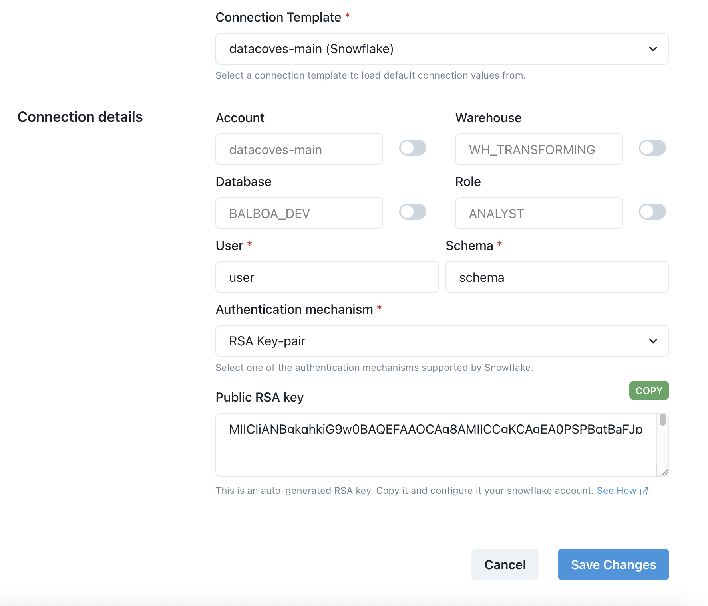

# How to Create/Edit a Service Connection

Navigate to the Service Connection page

To create a new Service Connection click the `New Connection` button.

A Service Connection consists of the following fields:

- **Name** Defines how the connection will be referred to by the automated service. Should be called `main` and will be included in the name of the environment variables seen below.
- **Environment** The Datacoves environment associated with this service connection.
- **Service** The Datacoves stack service where this connection should be made available e.g. Airflow
- **Connection Template** The connection template to base this service connection on(i.e. the defaults)
  Depending on the template selected, additional fields will be displayed with the default values entered in the connection template. These default values can be overridden by toggling the indicator next to the given value.

>[!TIP]The name of the service connection will be used to dynamically create environment variables seen below which we inject into Airflow.

  - `DATACOVES__<NAME>__ROLE`
  - `DATACOVES__<NAME>__ACCOUNT`
  - `DATACOVES__<NAME>__WAREHOUSE`
  - `DATACOVES__<NAME>__ROLE`
  - `DATACOVES__<NAME>__DATABASE`
  - `DATACOVES__<NAME>__SCHEMA`
  - `DATACOVES__<NAME>__USER`
  - `DATACOVES__<NAME>__PASSWORD`

