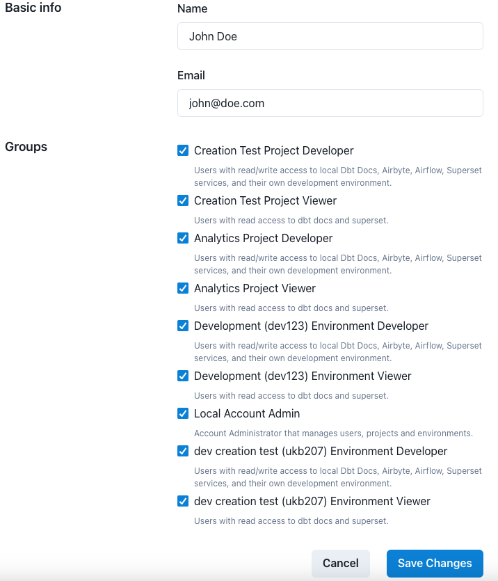

# How to Invite Someone to Your Account

## Overview

This page is used to invite users into your account.

Navigate to the invitations page

## Invitation Listing

This grid shows all pending invitations for your account. Each row also has two action buttons `delete` which cancels an invitation and `resend` to resend an invitation link.
To invite someone into your Datacoves account, click the `Invite User` button. On the invitation form you will be asked to provide the user's `Name` and their `Email`. Here you will also need to select the security `Groups` the user should belong to.

