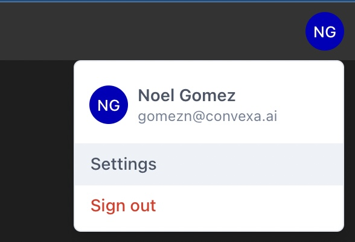
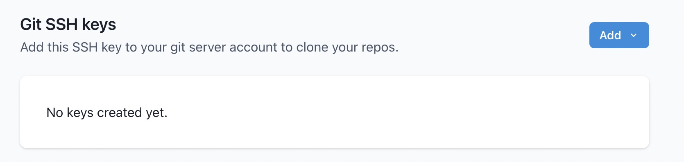
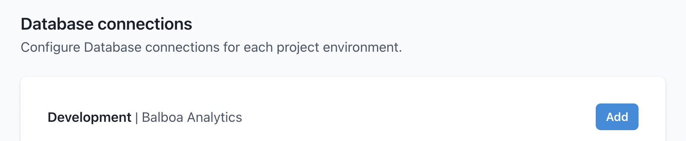
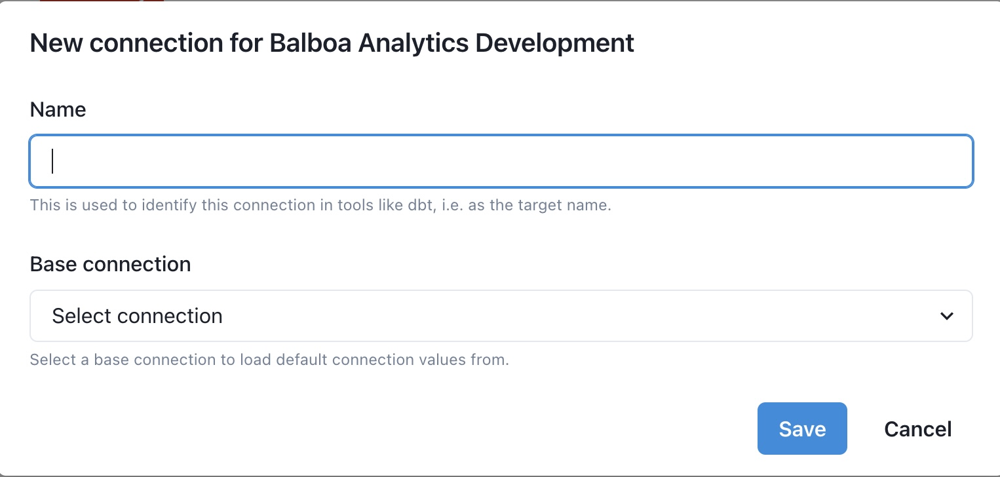
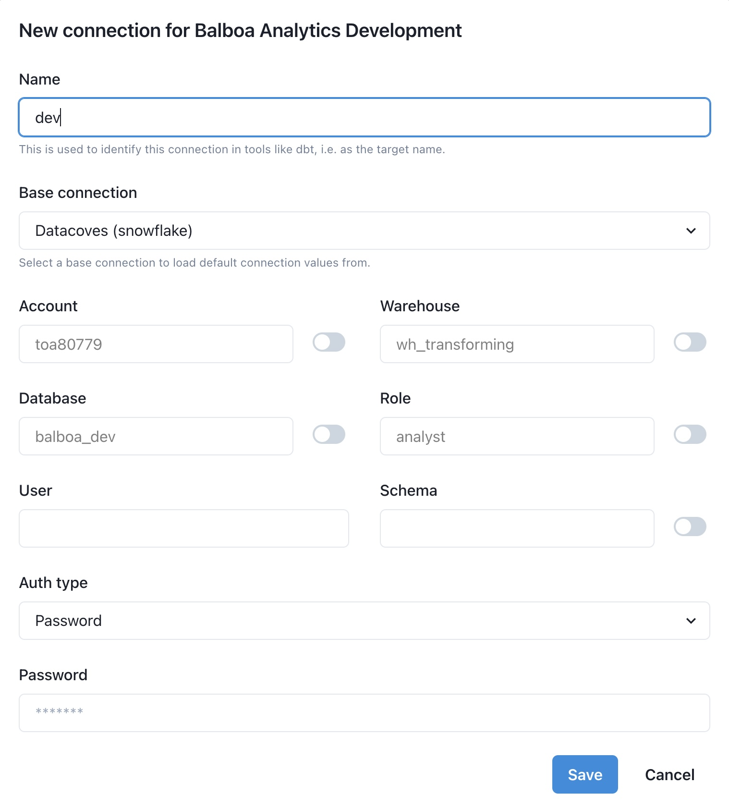
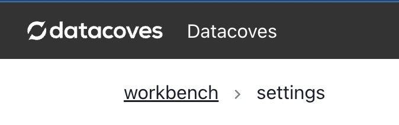

# How to Configure your Transform tab

When you open the Transform tab for the first time you will see an empty Visual Studio Code Environment.

We need to connect this editor to your git repository and to your data warehouse via dbt profile configuration.

## Open Your User Settings

At the top right corner of the page, click the User icon and select _Settings_



## Setup git connection credentials

On the settings page scroll down to the Git SSH keys section.



Click the Add drop down and select whether you want to provide an existing private key or have Datacoves auto generate one for you.


Datacoves will generate and display the corresponding public key, you will need to configure the public key for your git provider.


Click the _Copy_ button and follow the instructions to configure the public key for your git server.

[Github SSH Key Configuration Instructions](https://docs.github.com/en/authentication/connecting-to-github-with-ssh/adding-a-new-ssh-key-to-your-github-account)

[Gitlab SSH Key Configuration Instructions](https://www.theserverside.com/blog/Coffee-Talk-Java-News-Stories-and-Opinions/How-to-configure-GitLab-SSH-keys-for-secure-Git-connections#:~:text=Configure%20GitLab%20SSH%20keys,-Log%20into%20GitLab%20and%20click)

[Bitbucket SSH Key Configuration Instructions](https://dev.to/jorge_rockr/configuring-ssh-key-for-bitbucket-repositories-2925)

Once your public SSH key has been added to your git server, test your connection.


If Datacoves is able to connect to your Git repository, you will see _Tested_ next to the repository.


## Setup Snowflake Keys

When connecting to Snowflake, you can use either key based authentication or username/password authentication.

If using key based authentication, you will need to provide or generate a key which will need to be added to Snowflake (contact us for information on how to automate this integration with Snowflake).

Provide or automatically generate your keys. Then add the public key to Snowflake.


```
alter user <username> set rsa_public_key='<public key>';
```

More information can be found in the [Snowflake Documentation](https://docs.snowflake.com/en/user-guide/key-pair-auth.html#step-4-assign-the-public-key-to-a-snowflake-user)

## Setup Snowflake Connection

In the Database Connection Section, click _Add_



Give the connection a name, this will be used as your dbt target name and is typically _dev_. Next select a base connection. (A base connection will have defaults pre-configured by your administrator).

Fill in the rest of the fields and click _Save_



Datacoves will test the connection and display _Tested_ next to the connection if successful. Note that you can create additional dbt targets as show below. This will allow you to execute dbt commands passing a specific target such as `dbt run my_model -t prd`



You are now ready to transform your data with dbt. Scroll to the top of the screen, click _Workbench_. Note, Datacoves will take a couple of minutes to apply the new settings, clone your repo and finish setting up your environment for the first time.


