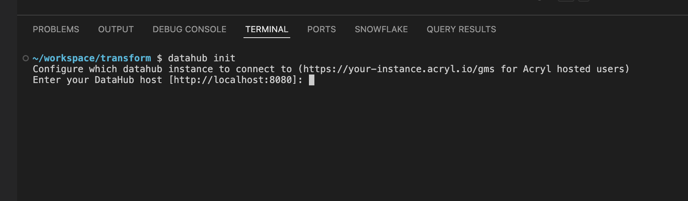
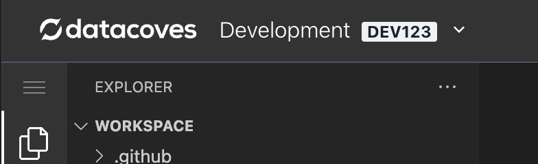
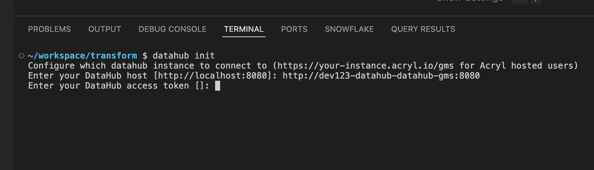
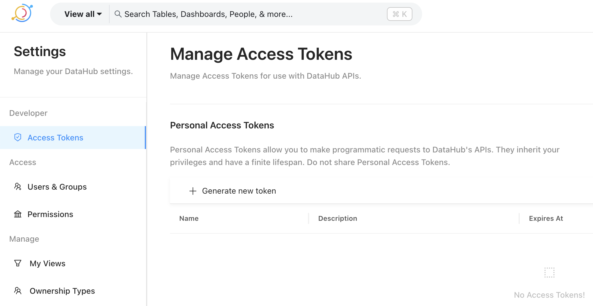
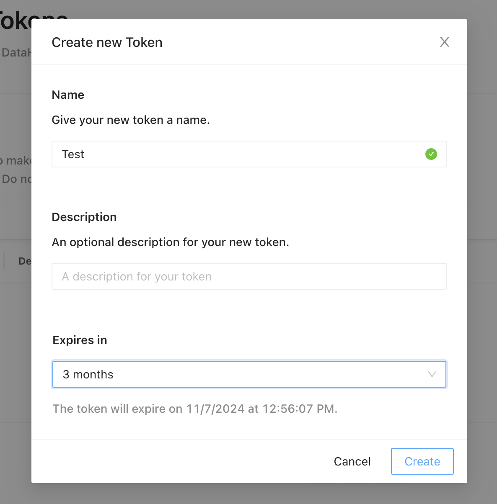
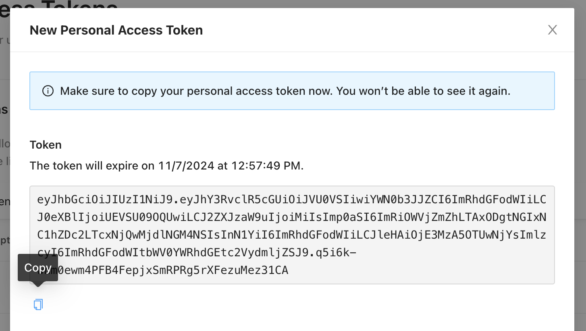

# How to use DataHub's CLI from your VS Code terminal

Connecting to your DataHub instance via your VS Code terminal can be extremely useful for performing maintenance on your metadata, running ingestions, deleting data, and more.

## Configure DataHub CLI

### Setting the DataHub Host URL

To establish a secure connection to your DataHub server, follow these steps:

1. Open a terminal in VS Code and run the following command:

```bash
datahub init
```


2. When prompted, enter the DataHub host URL. This will differ depending on which environment your Datahub instance is in.

#### Development Environment 

If your Datahub instance is within the Development environment use:

```bash
http://{environment-slug}-datahub-datahub-gms:8080
```

#### Cross Environment 

You can access Datahub in Prod or QA from the Dev environment. This is considered cross environment access and requires the use the full url as seen below. The slug will be for the environment where Datahub is hosted (QA or Prod). 

```bash
http://<slug>-datahub-datahub-gms.dcw-<slug>:8080
```

>[!NOTE] The environment slug can be found next to your environment name on the top left corner of your Datacoves workspace. For example, the environment slug below is `DEV123`, so the URL would be: `http://dev123-datahub-datahub-gms:8080`.



### Obtaining and Using a DataHub API Token

Next, you will be prompted to provide a DataHub access token to authenticate your connection.



**Please follow these steps:**

1. Open a new tab, navigate to Datacoves, head to the Observe tab within your environment, and click on DataHub.

2. Go to `Settings` (gear icon on the top right corner)

3. Click on the `Access Tokens` nav bar menu item



4. Click on `+ Generate new token` link, a popup window will show where you give the token a name, description and expiration date.



5. Click on create. Immediately after you will get a popup with the new token. Please don't close the window as you won’t be able to see it again.

6. Copy the token clicking on the copy button. 



7. Go back to the tab were you have VS Code terminal waiting for your input and paste the copied token. Press Enter.

## Useful commands

Once you successfully configured DataHub CLI, you can run `datahub` on the terminal and explore the different options the tool has to offer.

### Delete ingested data

Sometimes you loaded some data for testing purposes and the DataHub UI does not provide a way to delete it, you can easily achieve that by running `datahub delete`.

The command accepts different filters, a straight-forward one is `--platform`, i.e. `datahub delete --platform dbt`.

The command accepts different filters. A straightforward one is `--platform`, for example, `datahub delete --platform dbt`.