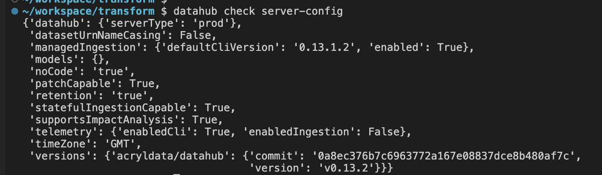

# How to use DataHub's CLI from your VSCode terminal

Connecting to your DataHub instance via your VSCode terminal might be really helpful to perform some maintenance in your metadata, run ingestions, delete data, etc.

## Configure DataHub CLI

### DataHub host url

First of all, you need to establish a secure connection to your DataHub server.

Open a terminal on VSCode and run `DataHub init`:

Type the DataHub host url, following this pattern: `http://{environment slug}-DataHub-DataHub-gms:8080`, the environment slug can be found next to your environment name in the header.

In this example it's `DEV123`, so the url becomes: http://dev123-DataHub-DataHub-gms:8080.

### DataHub API token

The next element you need to provide is a DataHub access token:

1. On a new tab, navigate to Datacoves and then DataHub
2. Go to `Settings` (gear icon on the top right corner)
3. Click on the `Access Tokens` nav bar menu item

4. Click on `+ Generate new token` link, a popup window will show where you give the token a name, description and expiration date.

5. Click on create and right after you'll see the new JWT token generated.
6. Copy the token clicking on this button and don't close the window as you won’t be able to see it again.

7. Go back to the tab were you have VSCode terminal waiting for your input and paste the copied token. Press Enter.
8. You can validate that the connection was correctly configured by running `DataHub check server-config`:

## Useful commands

Once you successfully configured DataHub CLI, you can run `DataHub` on the terminal and explore the different options the tool has to offer.

### Delete ingested data

Sometimes you loaded some data for testing purposes and the DataHub UI does not provide a way to delete it, you can easily achieve that by running `DataHub delete`.

The command accepts different filters, a straight-forward one is `--platform`, i.e. `DataHub delete --platform dbt`.

