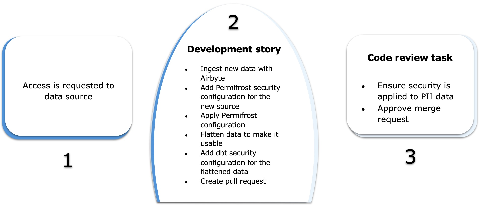

# How to develop and release a feature

Releasing a feature into production involves following a development process utilizing Github and GIthub Actions to run automated scripts along with human in the loop approvals as gates to move to the subsequent phase of deployment.

The high-level process is shown below.

## Development and Release cycle

1. **Development**
   1. Create a feature branch from the **Main branch** to start a new feature
   2. Add files with your SQL, run your dbt models and validate the query results
   3. Add documentation to clearly describe the models and their columns
   4. Add unit tests in your yml files to prove the agreed outputs are delivered and ensure data integrity
   5. Commit and push the new branch to Github

2. **Merge Request**
  1. In Github, create a pull request from the feature branch
  2. **CI Automation:** Checks are run to ensure code style and documentation requirements are met:
     1. A new database is created for each Pull Request
     2. Production manifest.json is downloaded
     3. A **dbt build** is executed building only the changed models and their dependencies along with tests
     4. Developed code is checked against configured [SQLFluff](https://docs.sqlfluff.com/en/stable/rules.html#rule-index) linting rules
     5. Governance tests are run using [dbt-checkpoint](https://github.com/dbt-checkpoint/dbt-checkpoint)
     6. Airflow checks are performed

3. **Code Review:**
  1. Team members review submitted code to confirm:
    1. Delivered code satisfies task requirements
    2. Any new models / columns are appropriately named
    3. Security has been applied correctly to any tables created by dbt
    4. Documentation is of a sufficient quality to allow future use
    5. Tests are appropriate for the model
    6. Approve merge request or provide feedback to developer for further improvement

4. **Continuous Delivery**
  1. **CD Automation**:
    1. A staging database is created by the blue/green deployment process by cloning the production database
    2. All changed models and their dependencies are created and tested in staging database
    3. If all tests pass, the staging database is swapped to become the production database and the old production database is dropped
    4. Merged pull request databases are dropped
    5. dbt documentation is built and deployed

## Delivery Journey - New Source

1. **Source Credentials**

   - Access is requested to data source system

2. **Development story:**

   1. Use AirByte, Fivetran or other ingestion tool to extract and load raw data from the new source into Snowflake
   2. Add Permifrost security config for the new source in raw database
   3. Apply permifrost config to grant developers access to raw source tables
   4. Create any flattening required to make the data usable
   5. Add dbt security configuration like masking policies to the flattened models
   6. Create pull request to deploy the new source to production

3. **Code review task:**
   1. Ensure security is applied to PII/Sensitive data
   2. Approve merge request

## Ongoing Processes

Before a story is added to development backlog:

1. Check sources are available in Snowflake for story or add story to ingest new data
2. Initial discovery of data is performed to understand the data and determine what steps may be required to deliver the requested output. Any data model design is agreed and work is broken up into sprint tasks
3. Assure any other requirements are well defined in story e.g. column descriptions, model layout, required tests, etc.
