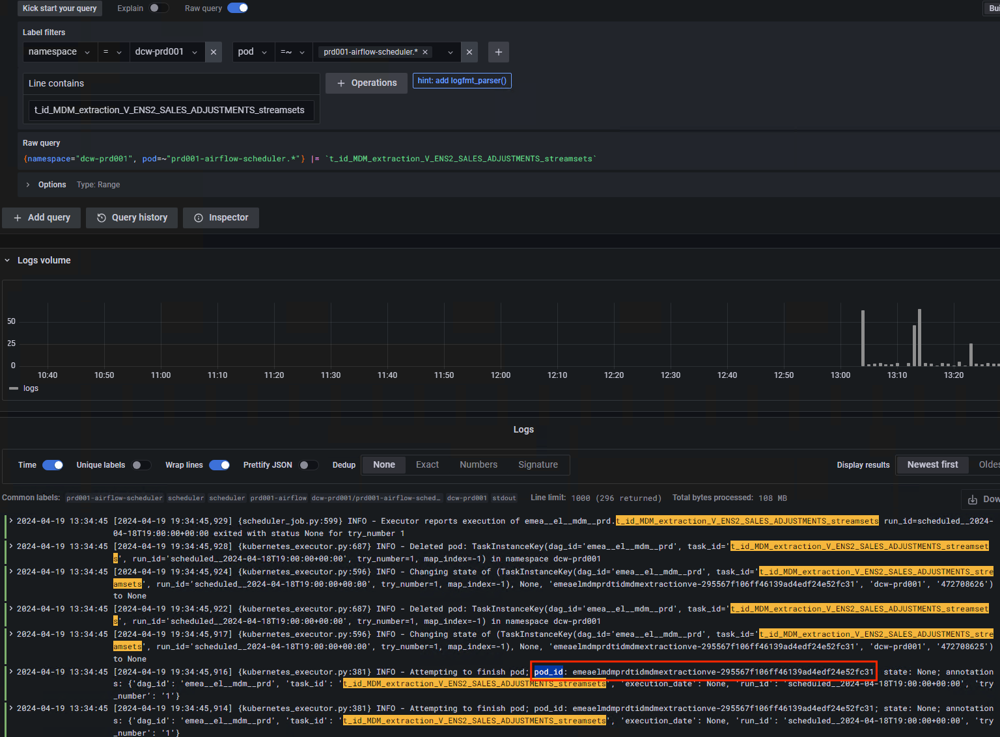
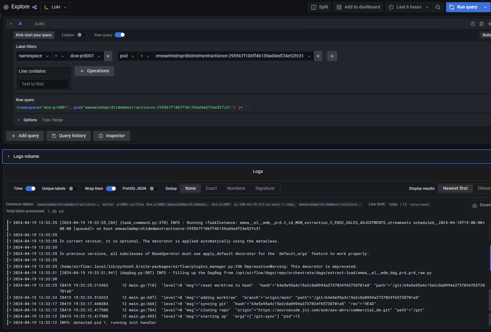

# Debug Airflow Workers

## How to review if there are error in git-sync/s3-sync containers?

We have already enabled the functionality in `git-sync` to retry a maximum of three times. If the synchronization with `git-sync` or `s3-sync` is not successful, the worker will fail, therefore the Airflow task will also fail.

To get the logs from `git-sync` or `s3-sync` we need to filter by namespace and by container. Below are some examples of how to do it.

1. Go to **Grafana** i.g. `https://grafana.<domain>`
2. Go to **Explore** select `Loki` datasource and perform the query with the following filters:

- **Namespace** = *dcw-my-slug-environment*
- **Container** =~ *git-sync**/*s3-sync**/

Examples:

```bash
# git-sync
{namespace="dcw-dnr240", container="git-sync"} |= ``  

# s3-sync
{namespace="dcw-dnr240", container="s3-sync"} |= ``  
```


## How to get Airflow workers?

1. Go to **Grafana** i.g. `https://grafana.<domain>`
2. Go to **Explore** select `Loki` datasource and perform the query with the following filters:

- **Namespace** = *dcw-my-slug-environment*
- **Pod** =~ *my-slug-environmet-airflow-scheduler.**
- **Line contains** |= *my-task*

*Note: Remember that you have to adjust the date and time parameters depending on the search you want to perform.*

E.g.:
```bash
{namespace="dcw-prd001", pod=~"prd001-airflow-scheduler.*"} |= `t_id_MDM_extraction_V_ENS2_SALES_ADJUSTMENTS_streamsets`
```



3. Copy the pod name
4. Go to **Explore** select `Loki` and perform the query with the following filters:

- **Namespace** = *dcw-my-slug-environment*
- **Pod** = *pod-name*

E.g.:
```bash
{namespace="dcw-prd001", pod="emeaelmdmprdtidmdmextractionve-295567f106ff46139ad4edf24e52fc31"} |= ``
```


