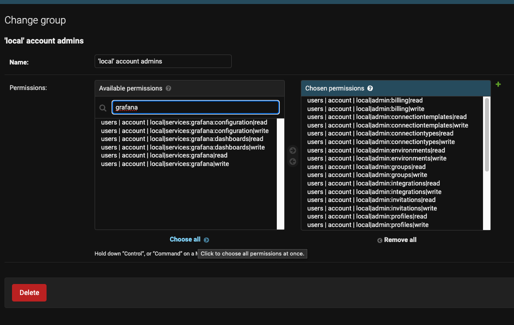

# Grant permissions to Grafana

1. Go to [Django admin groups](https://api.datacoveslocal.com/panel/auth/group/).
2. Edit a group that has your user.
3. Search `Grafana` permissions and `Choose all` (See image).
4. Save the group.
5. Go to [Grafana](https://grafana.datacoveslocal.com/)

