# Grafana Loki Storage

## Providers

- [AWS S3](#create-and-configure-aws-s3)
- [Azure Blob Storage](#create-and-configure-azure-blob-storage)


## AWS S3

### Permission

Limited: List, Read, Write

```json
{
	"Version": "2012-10-17",
	"Statement": [
		{
			"Effect": "Allow",
			"Action": [
				"s3:PutObject",
				"s3:GetObject",
				"s3:GetObjectVersion",
				"s3:DeleteObject",
				"s3:DeleteObjectVersion"
			],
			"Resource": ".../*"
		},
		{
			"Effect": "Allow",
			"Action": "s3:ListBucket",
			"Resource": "..."
		}
	]
}
```

### Create and Configure Life Cycle

1. Find and select **S3 Services**.
2. Click on **Create Bucket**.
3. `General configuration` you must choose the region y the name of bucket. Other values can be defaulted.
4. We need to create two `Lifecycle rules` to rotate our logs.
5. Select the new Bucket and then select `Management` tab.
6. Click `Create lifecycle rule`.
7. `Lifecycle rule configuration` you have to fill in the name: e.g: `Delete all fake objects after 30 days`.
8. **Prefix** you fill in `fake/`
9. **Lifecycle rule actions** you has to check `Expire current versions of objects`,
10. **Days after object creation** you must complete `30`
11. Save changes.
12. `Lifecycle rule configuration` you have to fill in the name: e.g: `Delete all index objects after 30 days`
13. **Prefix** you fill in `index/`
14. **Lifecycle rule actions** you has to check `Expire current versions of objects`,
15. **Days after object creation** you must complete `30`
16. Save changes.

*We must have two rules.*

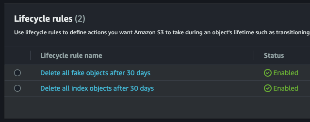

*Example of a rule.* 

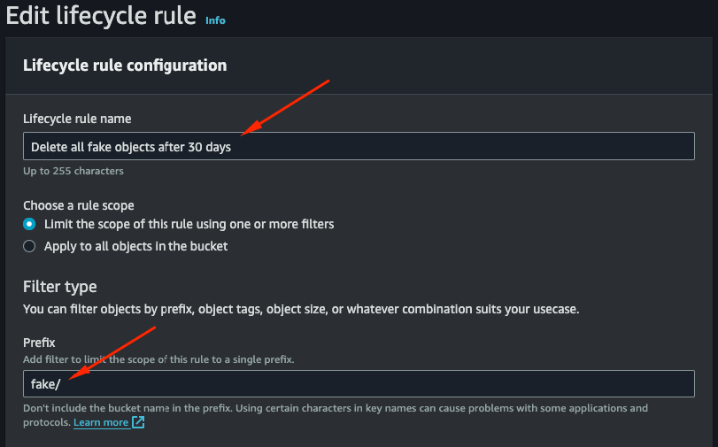

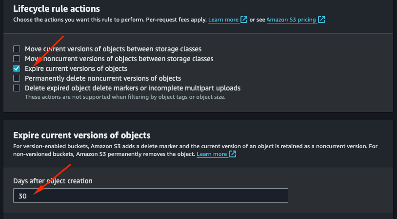

## Azure Blob Storage

### Create and configure Azure Blob Storage

1. Create new resource `Storage account`.
2. Select your **Subscription** and **Resource group**.
3. Complete the `Storage account name`.
4. Click **Review** (Other values can be defaulted).
5. Click **Create** (Other values can be defaulted).

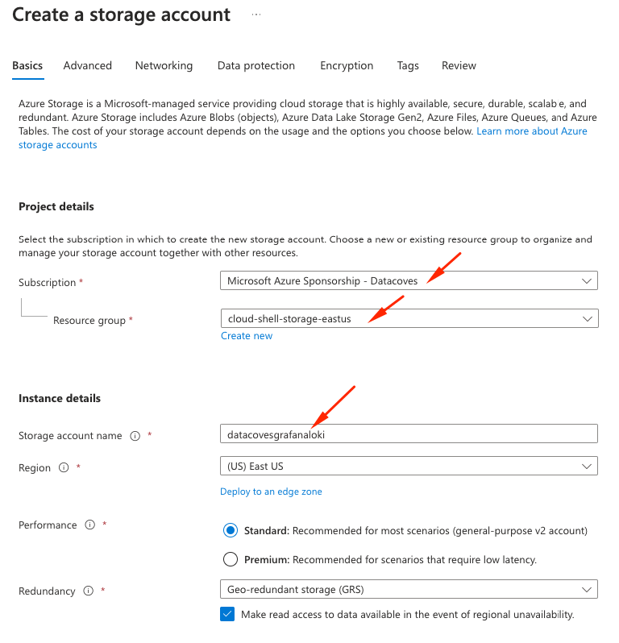

6. Select your new `Storage account`.
7. Click on **Containers** and add new container.

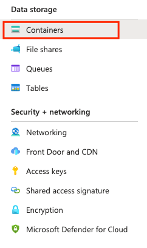

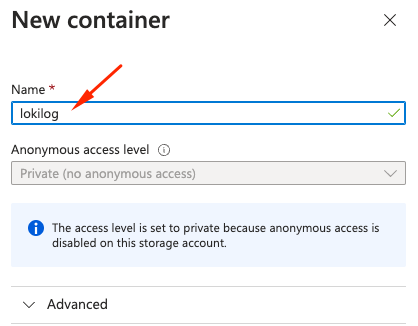

8. Select `Lifecycle management` and `Add a rule` to create new rule to rotate our logs.

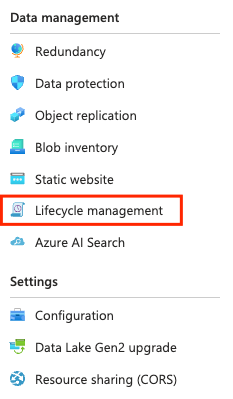

9. On **Details** tab we must complete the name (Delete all objects after 30 days) and select `Limit blobs with filter`.

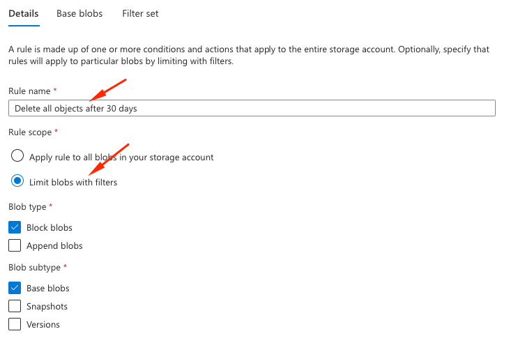

10. On **Filter set** tab we must add two **Blob prefix**: `<container-name>/fake/` and `<container-name>/index/`.

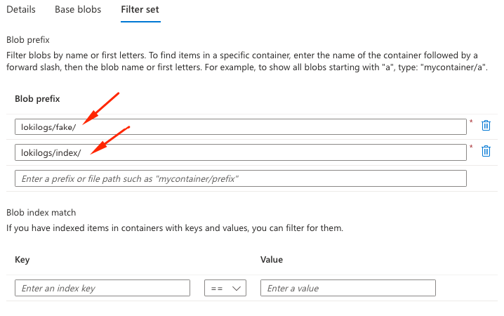

11. Click **Create**

### Get configuration data

1. **Account name** is the name of `storage account`.
2. Click on **Account key** (Key1)

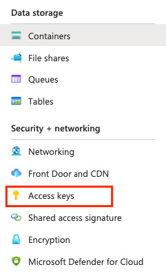

3. Select your **Container** and then **Properties**

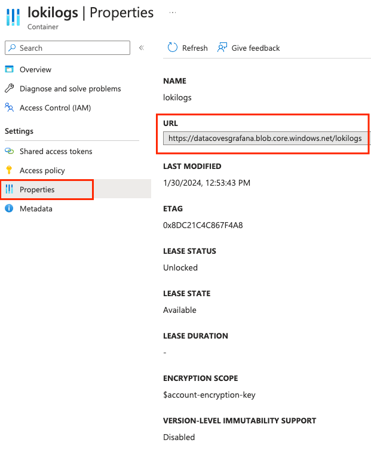
