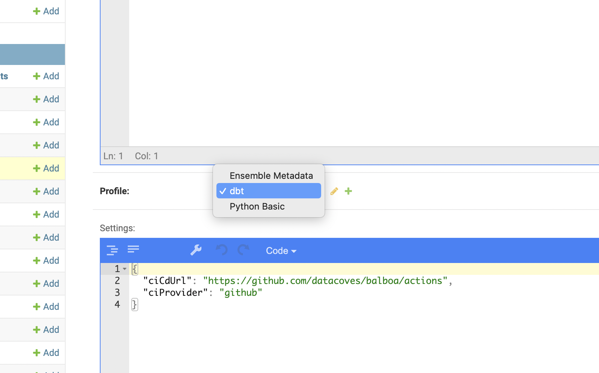

# Managing profiles and image sets

## How to create and use a profile + image set?

### 1. Create profile

A profile is used to create a reusable preconfigured environment.

1. Navigate to [profiles admin page](https://api.east-us-a.datacoves.com/panel/projects/profile/) and create a new one clicking on "Add Profile".
2. Review the checkboxes and uncheck the ones that are not appropiate, you might like to keep them all checked as suggested.
3. Add profile files accordingly. You might like to copy the exact same profile files configured on the [default profile](https://api.east-us-a.datacoves.com/panel/projects/profile/1/change/).

### 2. Create image set

Image sets are associated to profiles and they are used to build the images that will end up being used by code-server and/or airflow.

1. Navigate to the [Image set admin page](https://api.east-us-a.datacoves.com/panel/projects/profileimageset/) and click on "Create new image set".
2. Choose the profile you just created in `Profile`.
3. Choose the release from where the new images are going to be based on, typically the last release.
4. Set the common python requirements for both airflow and code-server images in the `Python requirements` field. Take a look at the help text under the field.
5. Set the specific python requirements for airflow or code server in the fields `Airflow requirements` or `Code server requirements`.
6. Finally, configure the extensions you need installed in code-server by adding urls to the .vsix files in the `Code server extensions` field.
7. Hit "Save and continue editing".
8. Click on "Build image set" button in the top right corner of the form. A background process will be triggered to build the images.
9. Keep refreshing the page every 1 minute until the field `Images` get populated with the final images cooked.

### 3. Start using you profile

Once you profile and image set are ready, you need to edit the environment you want to change and set the corresponding `profile` in such field. Environments are edited [here](https://api.east-us-a.datacoves.com/panel/projects/environment/).

### 4. Reload the workbench page

That's all, reload the page and don't forget to prepare your [mate](<https://en.wikipedia.org/wiki/Mate_(drink)>) to enjoy your analytics journey even more ;)
