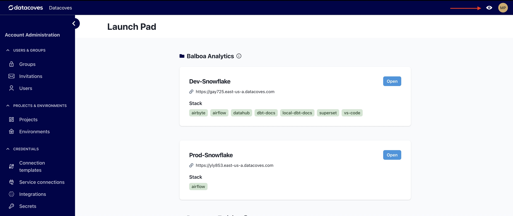

# Metrics and Logs How Tos

Datacoves provides [Grafana](/reference/metrics-and-logs/grafana.md) to monitor Airflow, Docker image builds, and more! 

A user must have a Datacoves role with Grafana access. These include, `Datacoves Admin`, `Project Admin`, or `Environment Admin`. 

