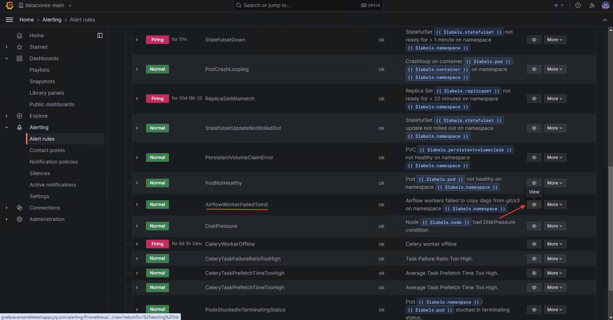
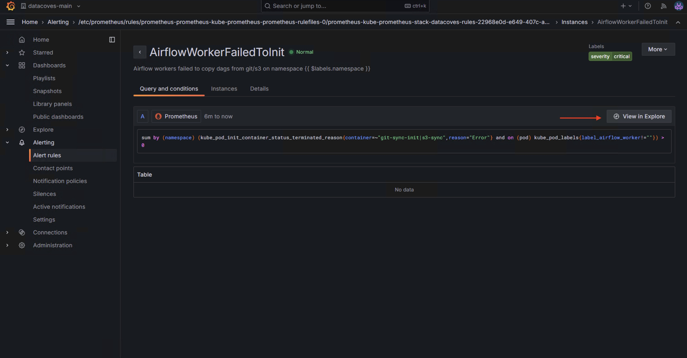

# Monitor git sync or s3 sync failure

This how-to will walk you through the steps to view git sync/s3 failures in Grafana.

### Step 1

A user with Grafana access can navigate to the Grafana UI by clicking on the Eye icon in the top right corner of the Datacoves UI.

### Step 2

Navigate to `Alerting` and select `Alerting rules`.

### Step 3

Expand the folder under `Mimir/Cortex/Loki` and select the `view` icon on the `AirflowWorkerFailedToInit` rule.

### Step 4

Select `View in Explorer` to see the Graph and other information. 

