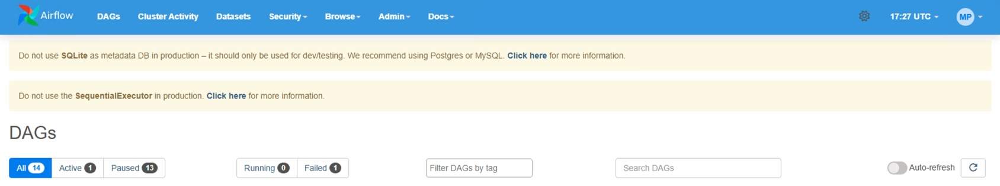

# My Airflow 101

Datacoves makes it easy to test DAGs quickly with My Airflow, a stand alone user instance of Airflow which tracks whatever branch the user is making changes to in VS Code. My Airflow allows developers to test their DAGs without need to push to their changes to a branch such as `airflow_development`. My Airflow is meant to test DAG naming, import errors, and basic configurations of a DAG. It has limitations and thus it is important to test your DAG in Team Airflow before pushing to production. That is because Team Airflow is more robust as it is configured to match your Production Airflow instance and runs using the Kubernetes Executor. 

<iframe src="https://www.loom.com/embed/279354dd8ea042c690ee731333f8f8a8?sid=3076574f-01f5-4a77-a4d0-26a021f8b78e" frameborder="0" webkitallowfullscreen mozallowfullscreen allowfullscreen style="position: absolute; top: 0; left: 0; width: 100%; height: 100%;"></iframe>

## Limitations

While My Airflow will make writing and testing DAGs quick it is important to cover its limitations.
1. My Airflow uses Sqlite
2. My Airflow **cannot** run tasks in parallel. It will run one task at a time.
3. Connections and variables from Team Airflow **will not** be automatically ported over to My Airflow. You will need to perform a variable import either manually or using the [`datacoves my import`](/how-tos/my_airflow/my-import.md) command in your terminal.
4. Emailing is not available in My Airflow.
5. Slack and Teams notifications are not available in My Airflow.

## Banner Colors

You can differentiate My Airflow from Team Airflow by the color of the banner

My Airflow = Light Blue 

Team Airflow = Dark Blue

