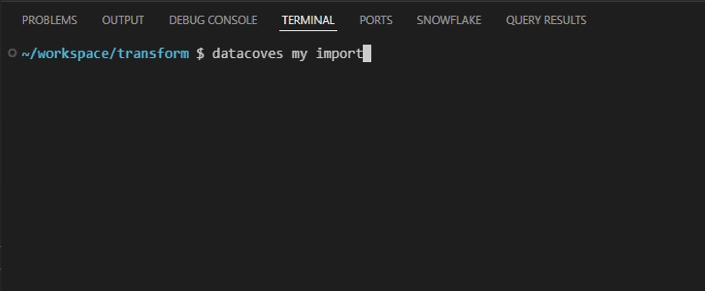

# Importing connections and variables from Team Airflow

For security purposes, connections and variables **do not** auto populate from Team Airflow ➡️ My Airflow. This means that **every user** will need to perform a variable/connection import to their My Airflow. An import will need to be done any time there is a new variable or connection added to keep Team Airflow and My Airflow in sync.  Once connections and variables are added to a user's My Airflow they will persist. 


## datacoves my import

>[!NOTE] You must have [initiated My Airflow](how-tos/my_airflow/start-my-airflow.md) before attempting to use the `datacoves my import` command. 

This command will import your Data Warehouse connections and Airflow variables over from Team Airflow to My Airflow. While the tool will do most of the work for you, sensitive variables will not be ported over for security reasons. You will be prompted to provide those secrets in the terminal.

Only connections that correspont to dbt adapter will be imported to My Airflow. Other connections will need to be re-created manually. Use the following command in your Datacoves VS Code terminal to start importing your Team Airflow variables and connections.

```bash
datacoves my import
```

