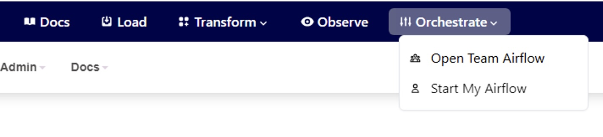

# How to use My Airflow

## Spin up your individual Airflow instance 

>[!ATTENTION] Unlike Team Airflow which is always running, My Airflow will spin down after 4 hours of inactivity. If you are an existing Datacoves user you may need to [migrate your environment variable based service connections](/how-tos/my_airflow/migrating-service-connections.md). Users need both the sysadmin and the developer [groups](reference/admin-menu/groups.md) to access My Airflow.

My Airflow is a single instance allocated to a user. This allows the user to test their DAG in isolation before pushing it to Team Airflow for more robust testing. To spin up your own My Airflow:

**Step 1:** Select the `Orchestrate` tab and select `Start My Airflow`.

This will restart your development environment.

**Step 2:** Once your environment has restarted. You will be notified that My Airflow is ready. Select `Open My Airflow` and click sign in. 

Thats it, your My Airflow instance is ready to use! 🎉 

## Using My Airflow to Develop DAGs

>[!NOTE] You must add or import connections and variables from Team Airflow. You can do this easily using `datacoves my import`. For more information follow [this documentation](/how-tos/my_airflow/my-import.md).

Developing your DAG using My Airflow is quick and easy. 

**Step 1:** Navigate to the `Transform` tab and start writing your DAG in the `orchestrate` directory. My Airflow will track whatever branch you have checked out ,however, we recommend developing in a feature branch. 

In the example below I have added a new DAG called `my_airflow_dag_test`.

**Step 2:** Switch to your My Airflow browser tab to see your DAG changes populate in near real time. Notice the Light Blue Airflow Banner which is distinct for My Airflow.

**Step 3:** Continue iterating until you are ready to test running your DAG. The limitation of My Airflow is that tasks cannot be run in parallel so robustly testing a DAG run is limited. Once you are ready to test a DAG run merge your feature branch into `airflow_development`. This will populate your DAG in Team Airflow. 
