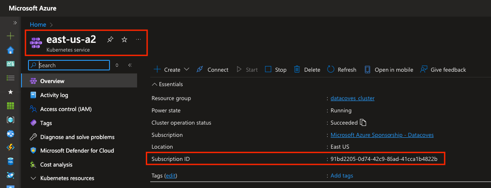
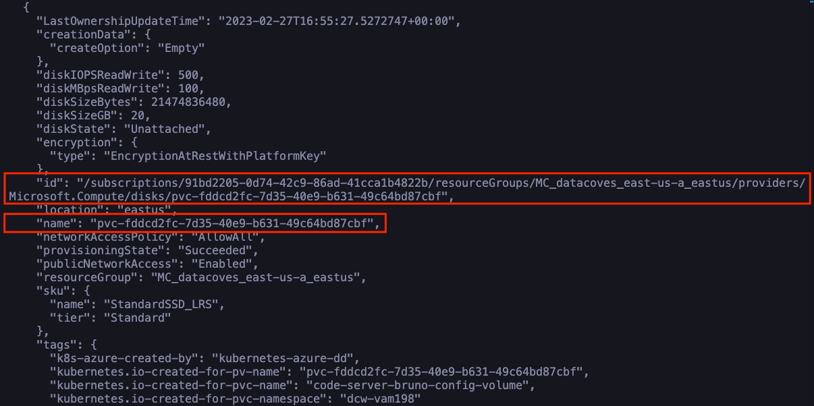

# Recover disk (PV) from Azure Kubernetes Service.

This guide describes how to move a disk from one Kubernetes cluster to another cluster. [More info](https://learn.microsoft.com/en-us/azure/aks/csi-disk-move-subscriptions)

Steps:

1. [Edit old pvc to Retain policy.](#edit-old-pvc-to-retain-policy)
2. [Get PV name.](#get-pv-name)
2. [Delete PVC to release the PV in the old cluster.](#delete-pvc-to-release-the-pv-in-the-old-cluster)
3. [Move the PV resource to new cluster using az cli.](#move-the-pv-resource-to-new-cluster-using-az-cli)
4. [Delete the PVC in the new cluster.](#delete-the-pvc-in-the-new-cluster)
5. [Create the PV and PVC in the new cluster.](#create-the-pv-and-pvc-in-the-new-cluster)

## Edit old pvc to Retain policy

The **persistent volume (PV)** that are created for **code server** has the delete policy, that means that when a disk is unbounded it is automatically deleted, therefore this policy must be modified to `Retain`.

```shell
# Get the persistent volumes. E.g:
kubectl get pv

# Edit the persistent volume. E.g:
kubectl patch pv pvc-2552cd9b-8231-409d-8b4b-a9d047415b53 -p '{"spec":{"persistentVolumeReclaimPolicy":"Retain"}}'
```

## Get PV name

```shell
# Get the persistent volumes. E.g:
kubectl get pv
```

## Delete PVC to release the PV in the old cluster

It is necessary to remove the **persistent volume claim (PVC)** to release the **persistent volume (PV)**.

```shell
# Get the persistent volumes. E.g:
kubectl -n dcw-dev123 get pvc

# Edit the persistent volume. E.g:
kubectl -n dcw-dev123 delete pvc code-server-bru-10-config-volume
```

## Move the PV resource to new cluster using az cli

1. Get the `cluster name` and `subcription id`.



2. Get the node resources groups. We will need the origin and destination.

```shell
# Get the node resources group
az aks show --resource-group <name-resource-group> --name <cluser-node> --query nodeResourceGroup -o tsv
```

3. Get the id disk.

```shell
# Get the origien node resource group. E.g:
az disk list --resource-group <node-resouorce-group>
```



4. Move the disk.

```shell
az resource invoke-action --action moveResources --ids "/subscriptions/<origin-subcription-id>/resourceGroups/<origin-node-resource-group>" --request-body "{  \"resources\": [\"<disk_id>\"],\"targetResourceGroup\":\"/subscriptions/<destination-subcription-id>/resourceGroups/<destination-node-resource-group>\" }"
```

## Delete the PVC in the new cluster.

This step is only necessary if the **persistent volume claim (PVC)** already exists.

```shell
# Get the persistent volumes. E.g:
kubectl -n dcw-dev123 get pvc

# Edit the persistent volume. E.g:
kubectl -n dcw-dev123 delete pvc code-server-bru-10-config-volume
```

## Create the PV and PVC in the new cluster

Create the following file `pvc.yaml` with the names and namespace correct.

- **pv-name**: E.g: `pvc-2581bfb0-b56a-4fbd-b302-67cf0ab43499`
- **pvc-name**: If you deleted the pvc, the name should be the same. E.g: `code-server-bru-10-config-volume`
- **namespace**: Kubernetes namespace to be applied.
- **disk-id-full-path**: E.g: `/subscriptions/91bd2205-0d74-42c9-86ad-41cca1b4822b/resourceGroups/MC_datacoves_east-us-a_eastus/providers/Microsoft.Compute/disks/pvc-fddcd2fc-7d35-40e9-b631-49c64bd87cbf`

```yaml
apiVersion: v1
kind: PersistentVolume
metadata:
  name: <pv-name>
spec:
  capacity:
    storage: 20Gi
  accessModes:
    - ReadWriteOnce
  persistentVolumeReclaimPolicy: Retain
  storageClassName: default
  csi:
    driver: disk.csi.azure.com
    readOnly: false
    volumeHandle: <disk-id-full-path>

---
apiVersion: v1
kind: PersistentVolumeClaim
metadata:
  name: <pvc-name>
  namespace: <namespace>
spec:
  accessModes:
    - ReadWriteOnce
  resources:
    requests:
      storage: 20Gi
  volumeName: <pv-name>
  storageClassName: default

```

Create the resources in Kubernetes

```shell
kubectl apply -f pvc.yaml

# Check the resources
kubectl get pvc | grep <pv-name> # pvc-2552cd9b-8231-409d-8b4b-a9d047415b53
kubectl -n dcw-dev123 get pvc code-server-bru-10-config-volume
```