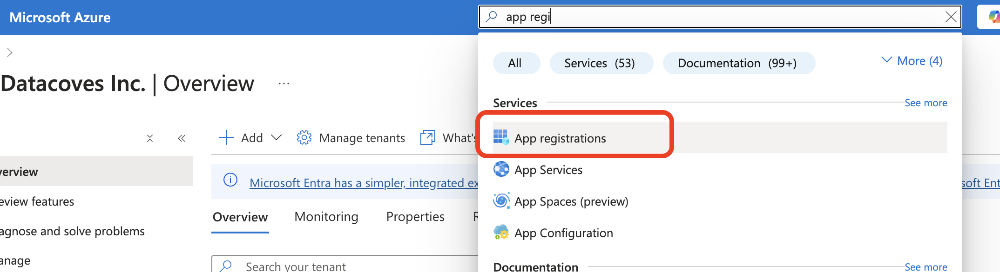
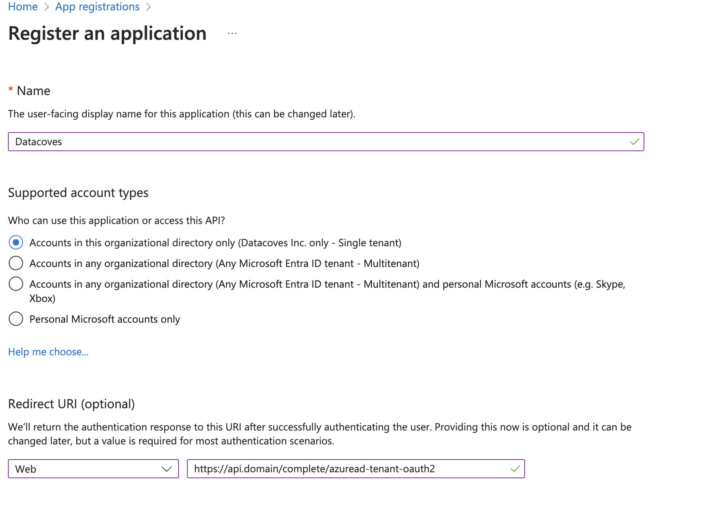
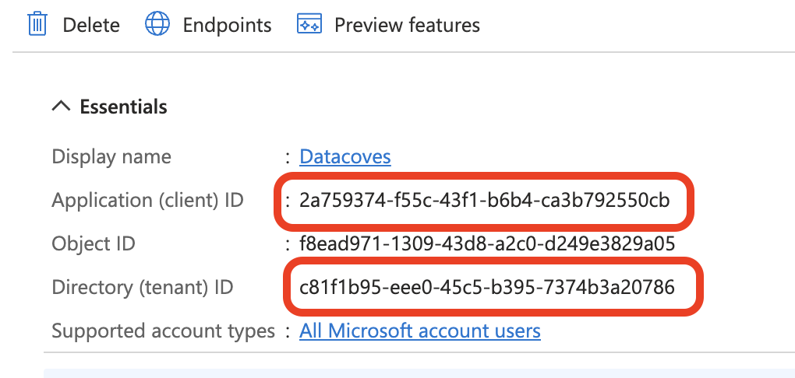
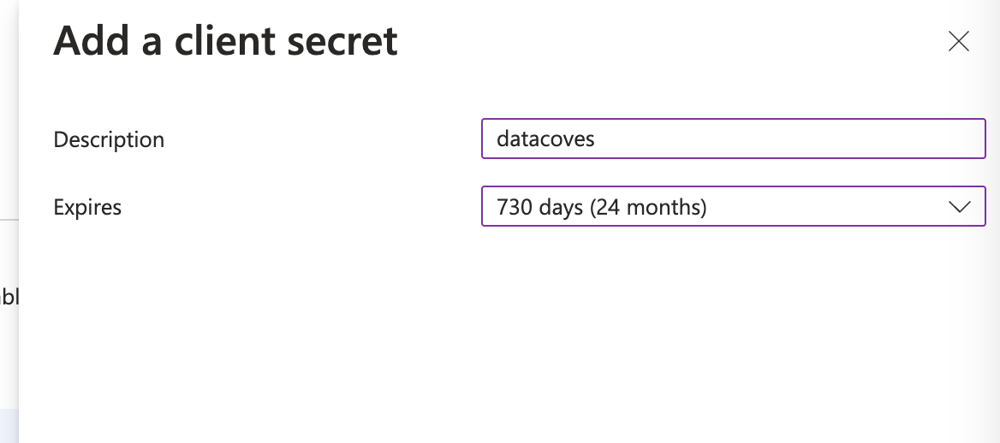
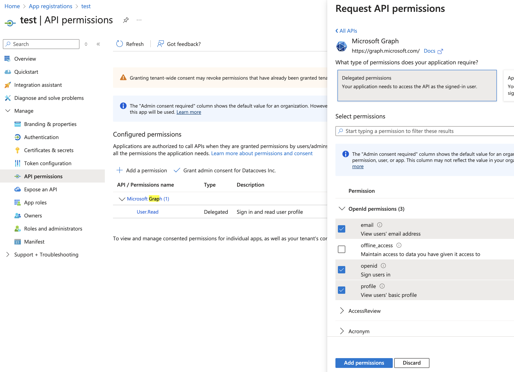
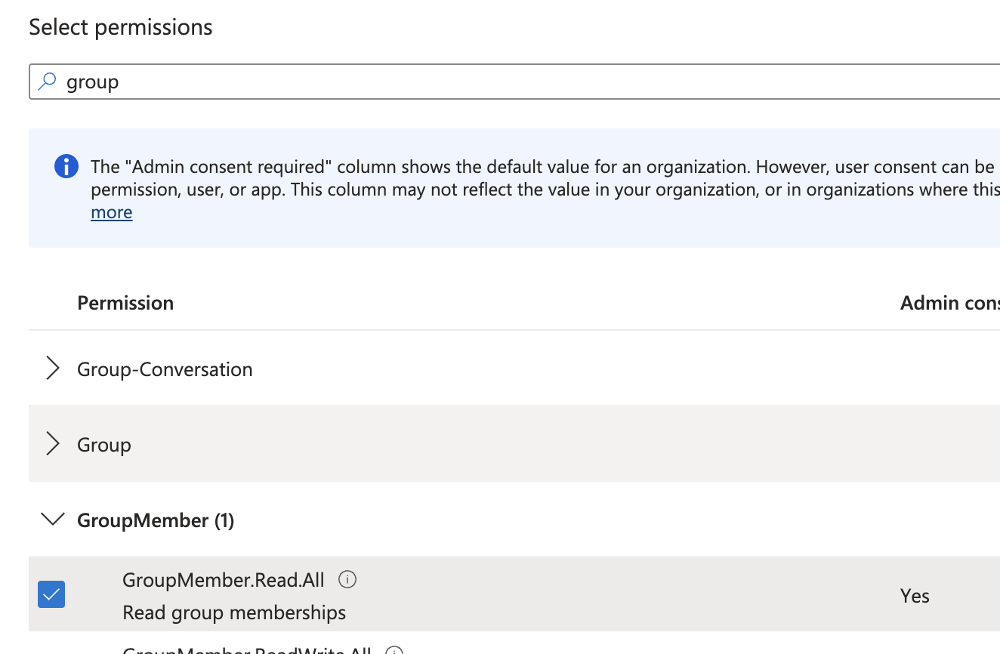
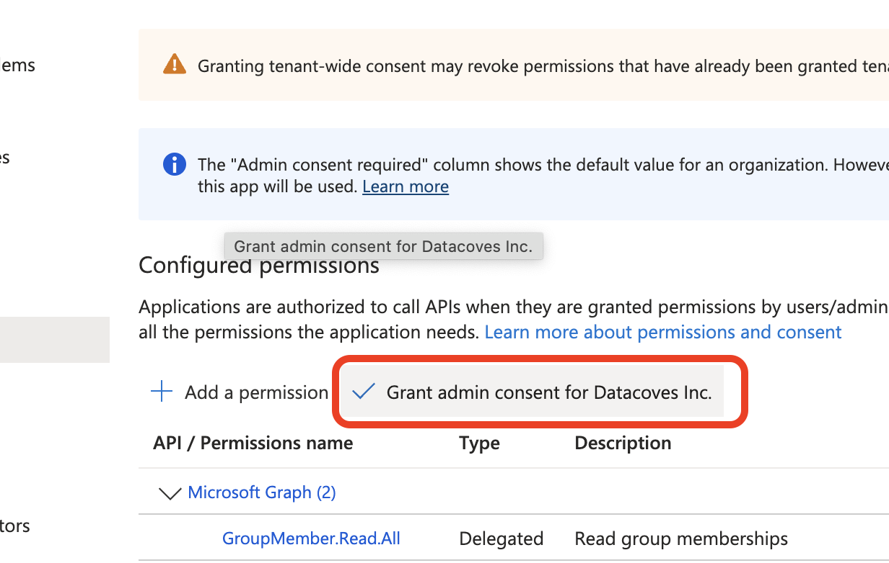
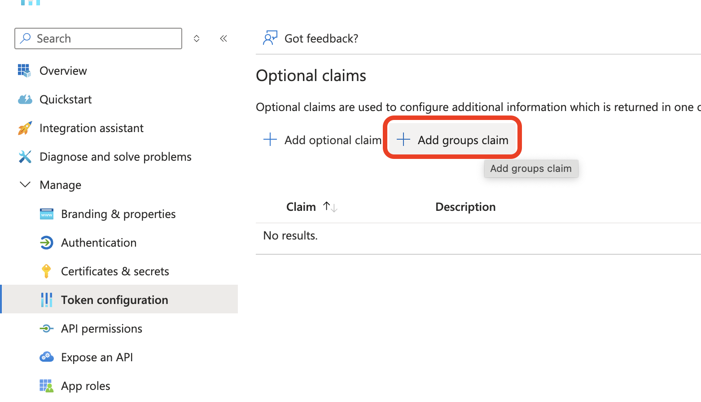
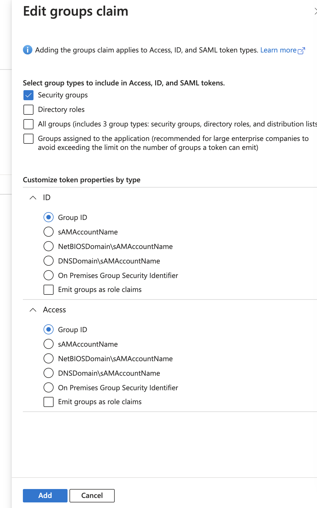

# How to set up oAuth authentication on Azure

> **NOTE:** This guide was based on this [Auth0 help page](https://auth0.com/docs/authenticate/identity-providers/enterprise-identity-providers/azure-active-directory/v2), it could require some adjustments.

This is done using Azure AD / Entra ID apps.

## Register new app

1. Navigate to App registrations on Azure Portal

2. Register a new App, choosing a name, selecting "Accounts in this organizational directory only (Datacoves Inc. only - Single tenant)" 
and providing a redirect url in the form of "https://api.{cluster_domain}/complete/azuread-tenant-oauth2"

3. Once created, get the client id and tenant id from the overview page

## Generate Client Secret

Navigate to 'Certificates & Secrets' and Generate a new client secret

Keep the value safe.

## Configure permissions

Navigate to app permissions and then 'Add permissions'. Select 'Microsoft Graph', then 'Delegated permissions', and the following OpenId permissions.

Also add permissions to read groups memberships if they're going to be used to determine permissions in Datacoves.

Finally, consent as an Admin the permissions granted by clicking on this button:

## Configure token

We need to include the groups claim in both the ID and access token, to do so, go to Token configuration:

Click on "Add groups claim", select "Security groups", make sure "Group ID" is selected in both ID and Access tokens and click on Add.

## Configure Datacoves

Configure the Client ID, Tenant ID and Client Secret accordingly on Datacoves using the env variables AZUREAD_CLIENT_ID, AZUREAD_TENANT_ID, and AZUREAD_CLIENT_SECRET.