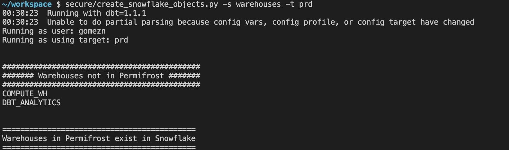
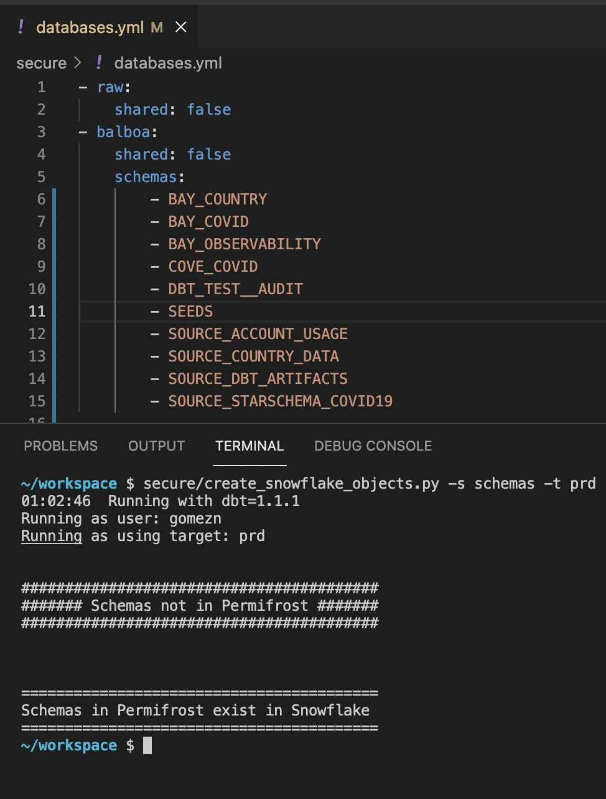

# How to add Warehouses, Schemas, and Roles to Snowflake

Since we want all changes to the warehouse to be driven by code, we employ Permifrost and some additional scripts to manage changes to Snowflake. (contact us for assistance configuring your repository with the additional scripts needed)

Using Permifrost Configuration Files, we will manage the following:

- Warehouse Creation
- Schema Creation
- Role Creation

We will also need to configure dbt to use custom schemas by updating `dbt_project.yml`

### create_snowflake_objects.py

To create objects in Snowflake, we leverage a script we created `create_snowflake_objects.py`. This script uses the permifrost config files and dbt to apply the changes to Snowflake. Note: When you run these scripts your user will need to have the SYSADMIN or SECURITYADMIN to create specific objects in Snowflake.


### Warehouse Creation

In the `secure/` folder of your repo, find the `warehouses.yml` file. Configure each warehouse you want to create in Snowflake.


Once the `warehouses.yml` file is configured run `secure/create_snowflake_objects.py -s warehouses -t prd` to create the warehouses using your dbt `prd` target for authentication.

You can use the `--dry-run` option to see the expected changes before they are applied to Snowflake.

The script will also report objects that exist in Snowflake but which are missing from the `warehouses.yml` configuration file. If no changes are needed in Snowflake because the warehouse already exists, this will also be displayed.



### Schema Creation

Schema creation is similar to warehouse creation. Schemas are configured in `secure/databases.yml` and the `secure/create_snowflake_objects.py -s schemas -t prd` command is run to create them. Note this script should run with the same role that normally runs your dbt jobs like _TRANSFORMER_DBT_



These schemas should align with what is configured in `dbt_project.yml`


### Role Creation

Before permifrost can be run, warehouses, schemas, and roles must already exist in Snowflake. Roles are defined in `secure/roles.yml` and created using `secure/create_snowflake_objects.py -s roles -t prd`. Note that roles will be created with the SECURITYADMIN role, so your user must have that role granted.

### Roles.yml

The roles.yml file contains all the roles and their associated grants. To keep things [DRY](https://en.wikipedia.org/wiki/Don%27t_repeat_yourself) we define object roles and then assign those to higher level roles and eventually to functional roles.

Object roles are created for; warehouses, databases, schemas, and tables (we use a single role to grant access to all tables within a schema).

We follow a naming convention as follows `z_<object>_<object_name>` for example:

``` yaml
- z_db_raw:
- z_db_raw_write:

- z_schema_raw:
- z_schema_source_dbt_artifacts:
- z_schema_bay_country:
- z_schema_cove_covid:

- z_wh_loading:
- z_wh_transforming:
```

We can then "bundle" these into higher level template roles by granting the object roles.

``` yaml
- z_base_analyst:
    member_of:
      - z_db_raw
      - z_db_balboa
      - z_db_balboa_tst
      - z_db_balboa_dev
      - z_db_snowflake
      - z_db_starschema_covid19

      - z_schema_raw
      - z_schema_snapshots

      - z_schema_source_account_usage
      - z_schema_source_country_data
      - z_schema_source_starschema_covid19
      - z_schema_seeds
      - z_schema_source_dbt_artifacts
      - z_schema_dbt_metrics
      - z_schema_dbt_test__audit
      - z_schema_bay_country
      - z_schema_bay_covid
      - z_schema_bay_observability
      - z_schema_cove_covid

      - z_wh_transforming
```

Finally, we can grant these template roles to functional roles modifying only the parts that make the functional roles different.

``` yaml
- analyst:
    member_of:
      - z_base_analyst
      - z_tables_views_general
      - z_policy_row_region_all

- analyst_pii:
    member_of:
      - analyst
      - z_policy_unmask_pii
```

Here we can see that an analyst gets everything (databases, schemas, warehouses) defined in the `z_base_analyst` template role and select to all tables in those schemas via `z_tables_views_general` and all the rows related to the entire region within those tables via `z_policy_row_region_all`.

The PII Analyst just has one additional grant `z_policy_unmask_pii` which allows them to see the values within masked columns.

A German analyst is pretty similar, but can only see the German(DE) rows vs all the rows for the region.

``` yaml
- de_analyst:
    member_of:
      - z_base_analyst
      - z_tables_views_general
      - z_policy_row_region_de

- de_business_analyst_pii:
    member_of:
      - de_analyst
      - z_policy_unmask_pii
```

### Running Permifrost

To run the permifrost script, you must follow the configuration instructions at the top of the `secure/run_permifrost.sh` file and configure the predefined variables like PERMISSION_BOT_ACCOUNT.

Once the file has been configured you can run `secure/run_permifrost.sh` to apply the role permissions defined in permifrost.
