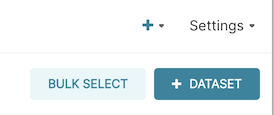
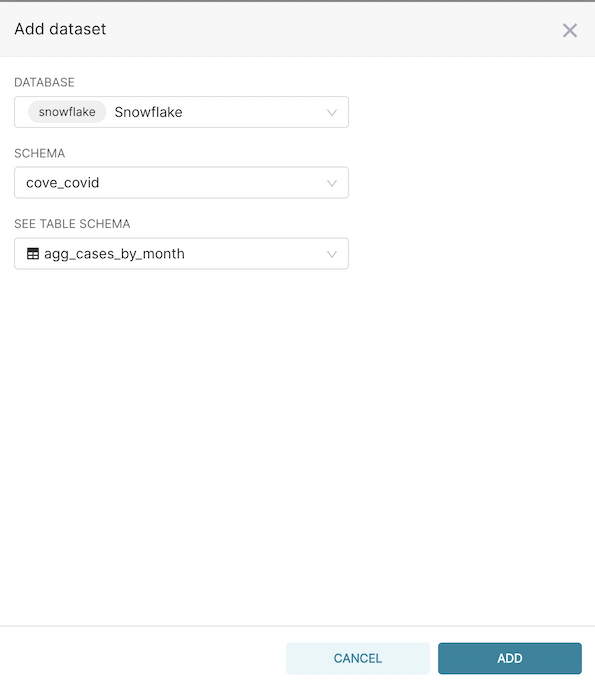

# How to Add a Dataset in Superset

To create visualizations you will need to create a dataset which is how a specific view or table is made available to Superset.

Unlike other tools, Superset has a philosophy to not show everything in the data warehouse since there may be things you do not want analysts to see.

We are working on integration with dbt so that specific models can be marked within a dbt properties file and automatically added as a Superset dataset. If you want to see this feature, send us a note support@datacoves.com

To add a **Dataset** on the menu bar, select **Data** -> **Datasets**

On this screen you will see a listing of all your datasets.

Click **+ Dataset**

Finally, select the Database, Schema, and Table / View for this dataset then click **Add** at the bottom of the window.

