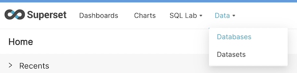
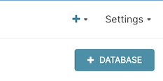

## How to Add a Database Connection in Superset

To use Superset you will need to create a connection to your database.

On the menu bar, select **Data** -> **Databases**

On this screen you will see a listing of all your database connections.

Click **+ Database**

Here you will select the type of connection you want to create. For Snowflake, click the dropdown on the bottom.

Finally, enter your Snowflake credentials (these will be shared by all users, so use a service account that has read access to your data marts)

>[!WARNING] For the Snowflake `Account` field you will need to find your account locator and replace `.` with `-`. Check out [Snowflake Fields](how-tos/datacoves/how_to_connection_template.md#for-snowflake-the-available-fields-are) on how to find your Snowflake account locator.

