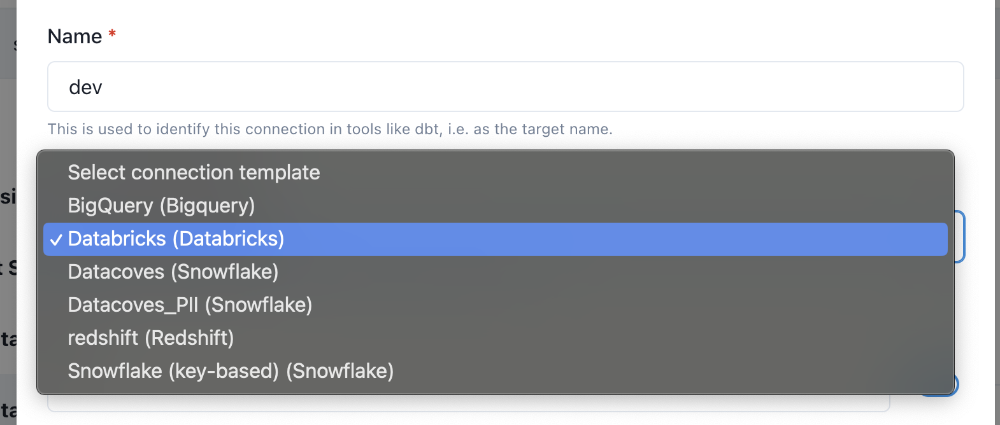
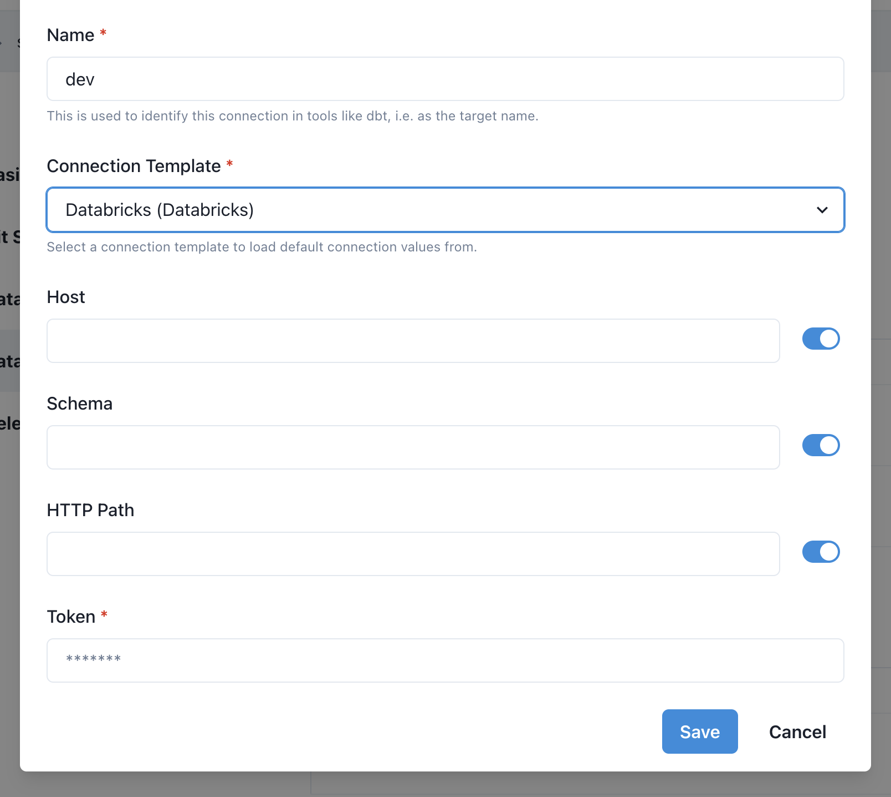

# Databricks Setup

In the Database Connection Section, click `Add`

Give the connection a name. 

>[!TIP]This will be used as your dbt target name and is typically `dev`. 

Next select a connection template. A connection template will have defaults pre-configured by your administrator.

## Fill in connection details 

Datacoves will test the connection and display `Tested` next to the connection if successful. 

Click `Save`