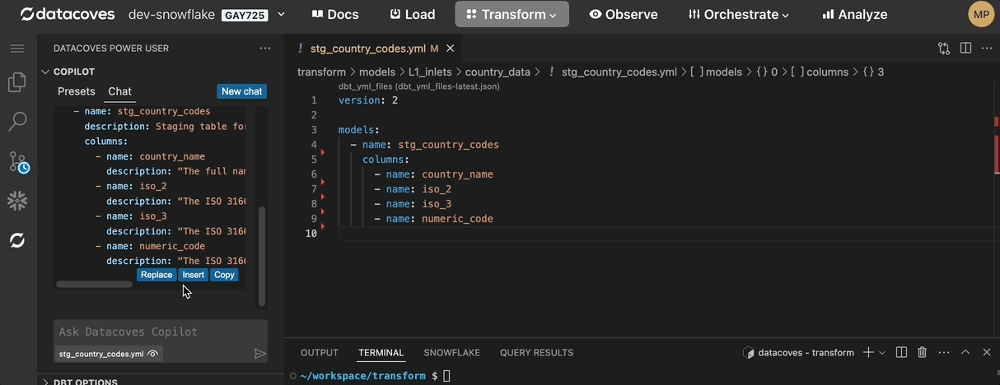

# Working with an LLM in Datacoves Copilot

Once you have [configured your LLM](/how-tos/vscode/datacoves-copilot/llm-config.md), working with the AI chat is a breeze! 

## Pre-configured presets

While there are many use cases for AI in the development workflow there are a couple of tasks that come up regularly. To improve the user experience, we have created some presets that provide the LLM with specific instructions to get the best result. Use these or configure your own custom presets. 

Current out of the box presents include:

- **Document dbt model:** Will provide descriptions for yml file you have open and provided as context.
- **Explain dbt model:** Will explain a dbt model file you have open and provided as context.
- **Explain dbt macro:** Will explain a dbt macro file you have open and provided as context.
- **Add descriptions to CSV:** Will provide descriptions for CSV files you have open and provided as context. 

## How to use the Chat/Presets

### Extension UI/UX

To use your LLM head to the Datacoves Power User extension and open up `Copilot`. 

### Provide files for context 
The most important thing to remember is providing context to the LLM. In order to do this simply open up the file you wish to work with.

### Send specific lines of code for context
Highlight the lines of code you wish to send.

### Don't provide context
In the case that you don't want to send an open file for context you can select the icon below.

## Using LLM code 
Datacoves Copilot makes copying AI generated code simple with 3 options. 

### Replace
Replace the entire code file with the llm code.

### Insert 
Insert llm code into your file.

### Copy
Traditional copy and paste. 

### New Chat
To start a new chat click on the `New Chat` button.

## Prefer a Video?

<iframe src="https://www.loom.com/embed/b6e987152c114c3c8d44dc7712aa3e22?sid=d8847855-38cc-4a84-90b3-6be7e660f8b5" frameborder="0" webkitallowfullscreen mozallowfullscreen allowfullscreen style="position: absolute; top: 0; left: 0; width: 100%; height: 100%;"></iframe>
