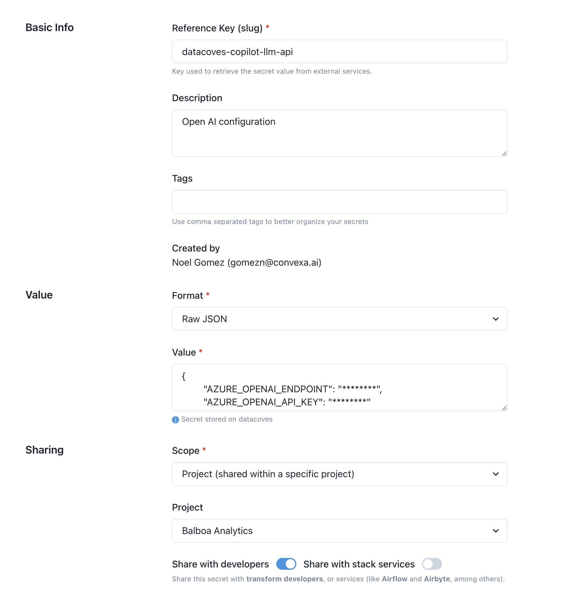

# Configure your LLM for Datacoves Copilot v1

> [!NOTE] Datacoves Copilot v1 only support the 4o model gpt model.

### Step 1: Create a Datacoves Secret

Creating a [Datacoves Secret](/how-tos/datacoves/how_to_secrets.md) requires some key fields to be filled out:

- **Name:** The secret must be named `datacoves-copilot-llm-api`
- **Description:** Provide a simple description such as: `Open AI config`
- **Format:** Select `Raw JSON`
- **Value**: The value will vary based on the LLM you are utilizing.
  - **Open AI:** You only need your API key. Head to [Open AI](https://platform.openai.com/api-keys) to create your key. `{"OPENAI_API_KEY": "Your key here"}`
  - **Azure Open AI:** This requires two credentials. Head to [ai.azure.com](https://ai.azure.com) to find your credentials under the [Deployments](https://learn.microsoft.com/en-us/azure/ai-services/openai/how-to/working-with-models?tabs=powershell#model-deployment-upgrade-configuration) tab. `{"AZURE_OPENAI_ENDPOINT": "Your endpoint here", "AZURE_OPENAI_API_KEY"  : "Your key here"}`
- **Scope:** Select the desired scope, either `Project` or `Environment`.
- **Project/Environment:** Select the `Project` or `Environment` that will access this LLM.

Lastly, be sure to toggle on the `Share with developers` option so that users with developer access will be able to use the LLM.

### Example Secret

