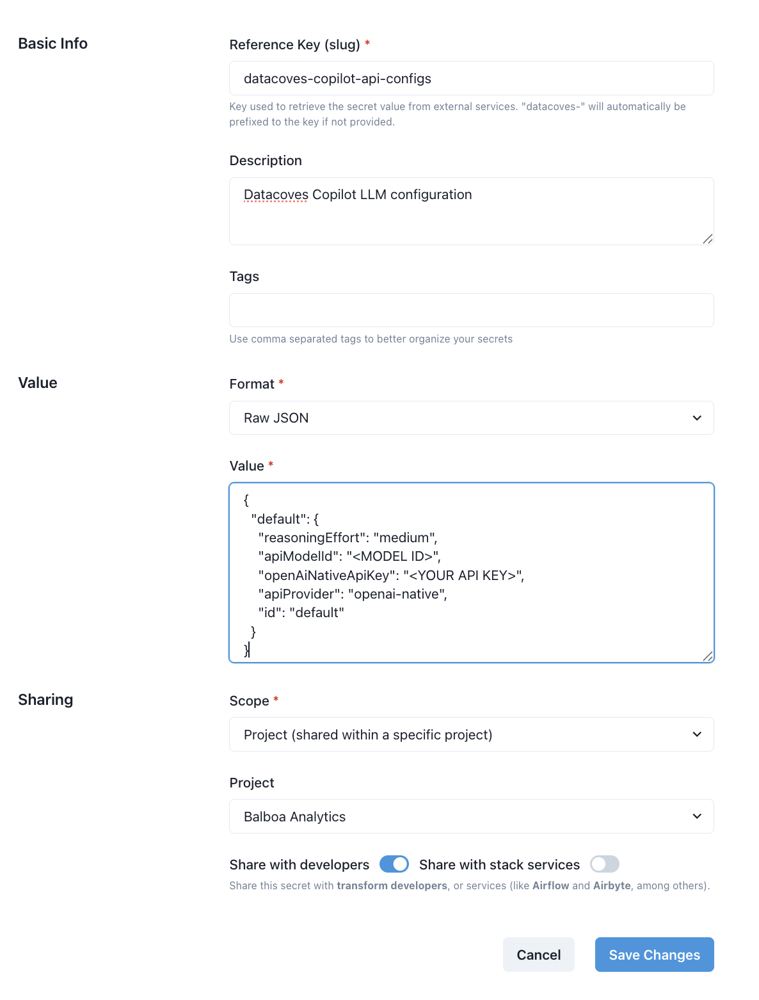

# Configure your LLM in Datacoves Copilot v2

## Create a Datacoves Secret

Creating a [Datacoves Secret](/how-tos/datacoves/how_to_secrets.md) requires some key fields to be filled out:

- **Name:** The secret must be named `datacoves-copilot-api-configs`
- **Description:** Provide a simple description such as: `Datacoves Copilot config`
- **Format:** Select `Raw JSON`
- **Value**: The value will vary depending on the LLM you are utilizing, see `Value formats by LLM Provider` section.
- **Scope:** Select the desired scope, either `Project` or `Environment`.
- **Project/Environment:** Select the `Project` or `Environment` that will access this LLM.

Lastly, be sure to toggle on the `Share with developers` option so that users with developer access will be able to use the LLM.


### Value formats by LLM Provider

#### Amazon Bedrock

```json
{
  "default": {
    "apiModelId": "<MODEL ID>",
    "awsAccessKey": "<YOUR ACCESS KEY>",
    "awsSecretKey": "<YOUR ACCESS SECRET KEY>",
    "awsSessionToken": "<YOUR SESSION TOKEN>",
    "awsRegion": "<REGION ID>",
    "awsCustomArn": "",
    "apiProvider": "bedrock",
    "id": "default"
  }
}
```

#### Anthropic

```json
{
  "default": {
    "todoListEnabled": true,
    "consecutiveMistakeLimit": 3,
    "apiKey": "<YOUR API KEY>",
    "apiProvider": "anthropic",
    "id": "default"
  }
}
```

#### Cerebras

```json
{
  "default": {
    "apiModelId": "<MODEL ID>",
    "cerebrasApiKey": "<YOUR API KEY>",
    "apiProvider": "cerebras",
    "id": "default"
  }
}
```

#### Chutes AI

```json
{
  "default": {
    "apiModelId": "<MODEL ID>",
    "chutesApiKey": "<YOUR API KEY>",
    "apiProvider": "chutes",
    "id": "default"
  }
}
```

#### DeepSeek

```json
{
  "default": {
    "apiModelId": "<MODEL ID>",
    "deepSeekApiKey": "<YOUR API KEY>",
    "apiProvider": "deepseek",
    "id": "default"
  }
}
```

#### Glama

```json
{
  "default": {
    "glamaModelId": "<MODEL ID>",
    "glamaApiKey": "<YOUR API KEY>",
    "apiProvider": "glama",
    "id": "default"
  }
}
```

#### Google Gemini

```json
{
  "default": {
    "apiModelId": "<MODEL ID>",
    "geminiApiKey": "<YOUR API KEY>",
    "apiProvider": "gemini",
    "id": "default"
  }
}
```

#### Hugging Face

```json
{
  "default": {
    "huggingFaceApiKey": "<YOUR API KEY>",
    "huggingFaceModelId": "<MODEL ID>",
    "huggingFaceInferenceProvider": "auto",
    "apiProvider": "huggingface",
    "id": "default"
  }
}
```

#### Mistral

```json
{
  "default": {
    "apiModelId": "<MODEL ID>",
    "mistralApiKey": "<YOUR API KEY>",
    "apiProvider": "mistral",
    "id": "default"
  }
}
```

#### Ollama

```json
{
  "default": {
    "ollamaModelId": "<MODEL ID>",
    "ollamaBaseUrl": "<BASE URL>",
    "ollamaApiKey": "<YOUR API KEY>",
    "apiProvider": "ollama",
    "id": "default"
  }
}
```

#### OpenAI

```json
{
  "default": {
    "reasoningEffort": "medium",
    "apiModelId": "<MODEL ID>",
    "openAiNativeApiKey": "<YOUR API KEY>",
    "apiProvider": "openai-native",
    "id": "default"
  }
}
```

#### OpenAI Compatible

```json
{
  "default": {
    "reasoningEffort": "medium",
    "openAiBaseUrl": "<BASE URL>",
    "openAiApiKey": "<YOUR API KEY>",
    "openAiModelId": "<MODEL ID>",
    "openAiUseAzure": false,
    "azureApiVersion": "",
    "openAiHeaders": {},
    "apiProvider": "openai",
    "id": "default"
  }
}
```

Set `"openAiUseAzure": true` when using Azure, and optionally a specific version `"azureApiVersion": "<VERSION>"`.

Fine tune model usage using this additional key:

```json
"openAiCustomModelInfo": {
    "maxTokens": -1,
    "contextWindow": 128000,
    "supportsImages": true,
    "supportsPromptCache": false,
    "inputPrice": 0,
    "outputPrice": 0,
    "reasoningEffort": "medium"
}
```

#### Open Router

```json
{
  "default": {
    "reasoningEffort": "medium",
    "openRouterApiKey": "<YOUR API KEY>",
    "openRouterModelId": "<MODEL ID>",
    "apiProvider": "openrouter",
    "id": "default"
  }
}
```

#### Requesty

```json
{
  "default": {
    "reasoningEffort": "medium",
    "requestyApiKey": "<YOUR API KEY>",
    "requestyModelId": "<MODEL ID>",
    "apiProvider": "requesty",
    "id": "default"
  }
}
```

#### xAI Grok

```json
{
  "default": {
    "reasoningEffort": "medium",
    "apiModelId": "<MODEL ID>",
    "xaiApiKey": "<YOUR API KEY>",
    "apiProvider": "xai",
    "id": "default"
  }
}
```

### Example Secret


