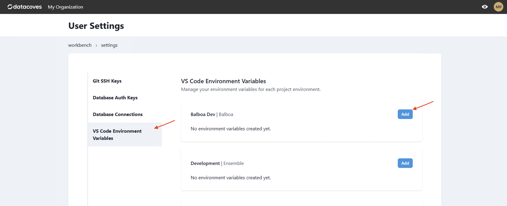
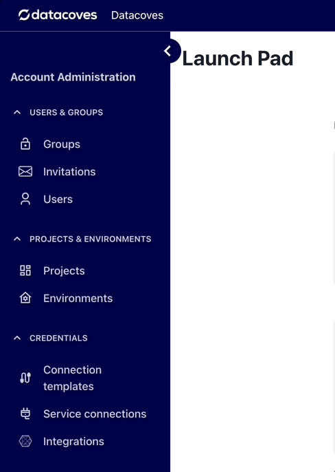
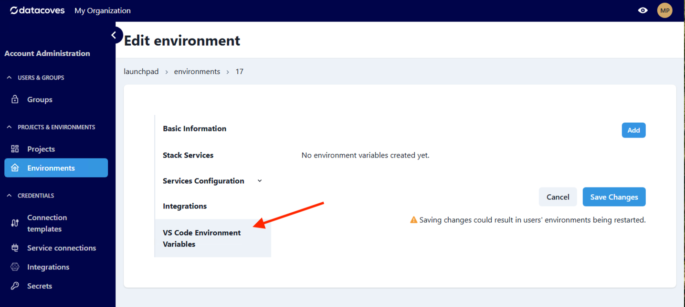
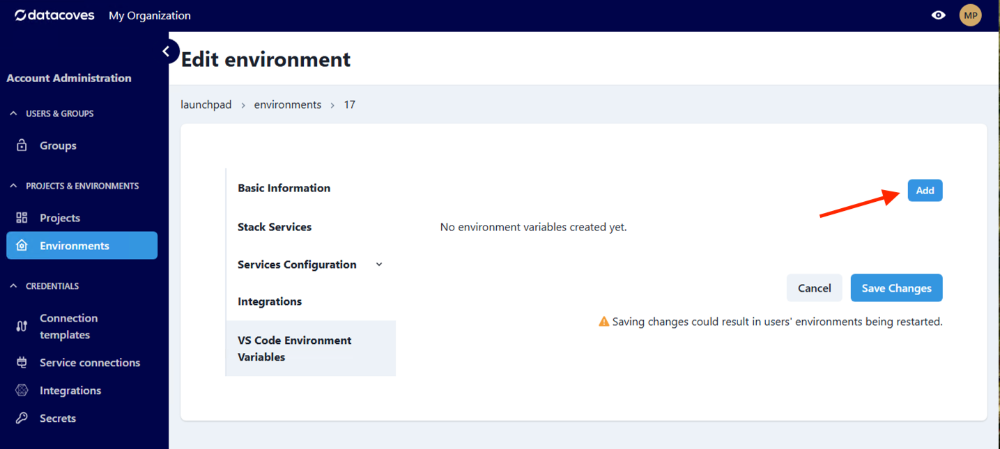
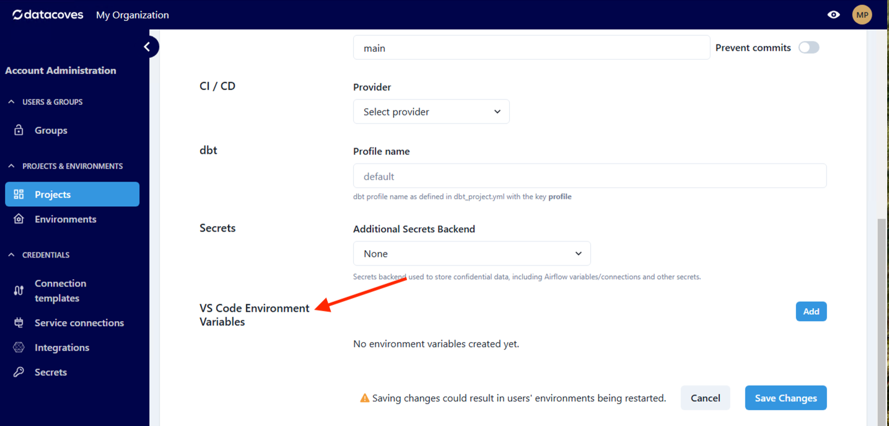
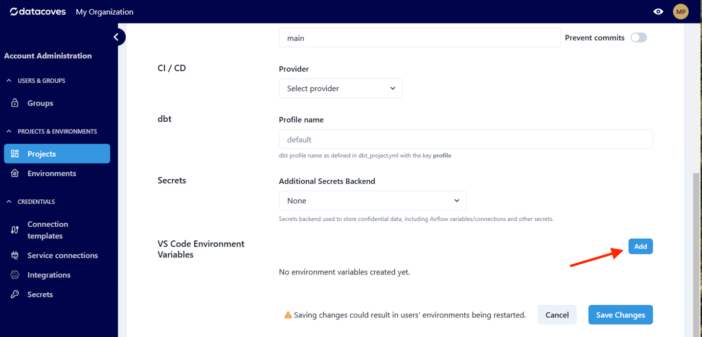
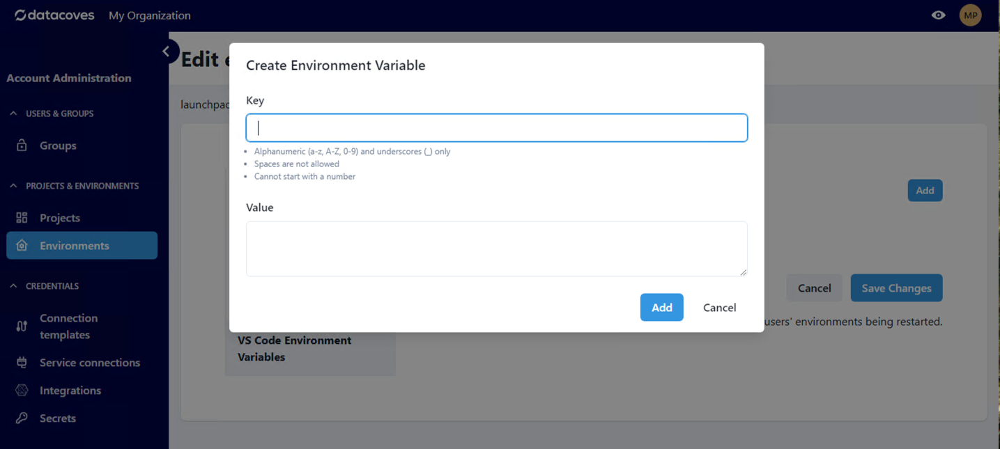
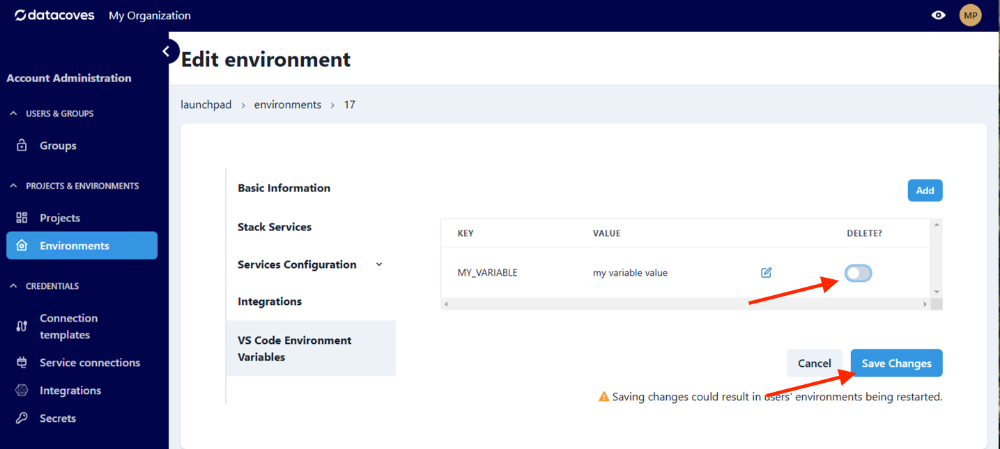

# How to add Environment variables to VS Code

## Table of Contents
- [Overview of Environment Variables in VS Code](#overview-of-environment-variables-in-vs-code)
- [User Level Environment Variables](#user-level)
- [Environment Level Environment Variables](#environment-level)
- [Project Level Environment Variables](#project-level)
- [Creating Environment Variables](#creating-variables)
- [Deleting Environment Variables](#deleting-variables)

## Overview of Environment Variables in VS Code

Datacoves injects several[ environment variables](/reference/vscode/datacoves-env-vars.md) on your behalf. However, you may need to add additional variables to run scripts, test code etc.  This doc will walk you through adding your own environment variables at the user, environment and project level. These variables are only available in your VS Code, not Airflow. For Airflow we recommend you use Airflow Variables or [Datacoves Secrets](/reference/admin-menu/secrets.md)

## User Level 

Environment variables set at the user level will only be available to the workspace environment of the individual who created them. 

### Step 1: Navigate to your user settings in the top right-hand corner

### Step 2: Navigate to `VS Code Environment Variables`
### Step 3: Select `Add`

## Environment Level

>[!NOTE] You must have admin permissions to add variables across the project or user environments. 

Environment level variables will be available to everyone with access to the environment ie) The Development Environment. 

### Step 1: Navigate to the environment menu

### Step 2: Navigate to `VS Code Environment Variables`

### Step 3: Select `Add`

## Project Level

Project level variables will be available across all environments in a project. 

### Step 1: Navigate to the project menu

### Step 2: Navigate to `VS Code Environment Variables`

### Step 3: Select `Add`

## Creating variables

Creating variables is simple. Add the key following the correct format and add the desired value.

## Deleting variables

Deleting variables is also simple. Simply navigate to the Project or Environment settings. 

### Step 1: Toggle the delete option or the red trashcan

### Step 2: Save Changes

If you do not save changes, the variable will not be deleted.

