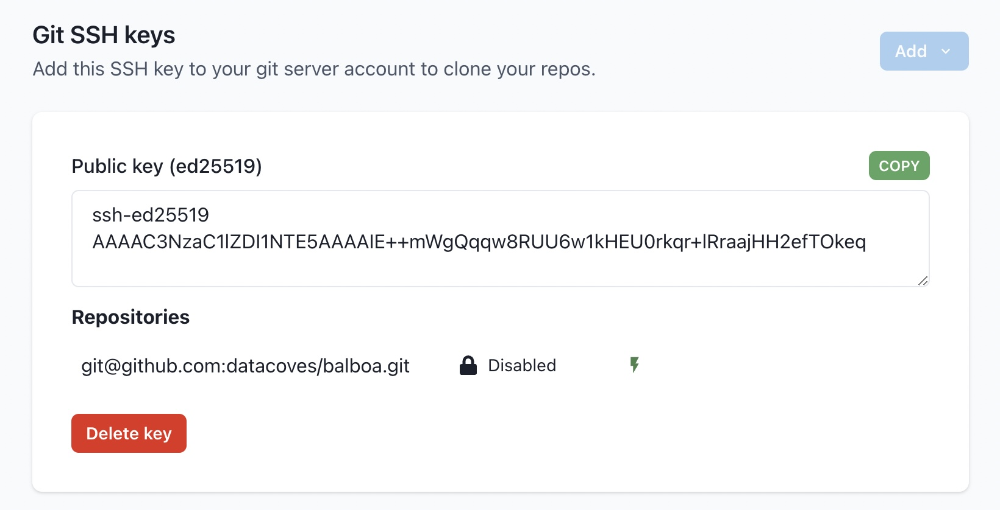

# How to Configure your VS Code in the Datacoves Transform tab

When you first log into Datacoves, you will see that VS Code is disabled.

We need to connect to your git repository and to your data warehouse and configure your dbt profiles.yml. To do this, you need to update your user settings.

## Open Your User Settings

At the top right corner of the page, click the User icon and select _Settings_

## Setup git connection credentials

On the settings page scroll down to the Git SSH keys section.

Click the Add drop down and select whether you want to provide an existing private key or have Datacoves auto generate one for you.

Datacoves will generate and display the corresponding public key, you will need to configure the public key for your git provider.

Click the _Copy_ button and follow the instructions to configure the public key for your git server.

[Github SSH Key Configuration Instructions](https://docs.github.com/en/authentication/connecting-to-github-with-ssh/adding-a-new-ssh-key-to-your-github-account)

[Gitlab SSH Key Configuration Instructions](https://www.theserverside.com/blog/Coffee-Talk-Java-News-Stories-and-Opinions/How-to-configure-GitLab-SSH-keys-for-secure-Git-connections#:~:text=Configure%20GitLab%20SSH%20keys,-Log%20into%20GitLab%20and%20click)

[Bitbucket SSH Key Configuration Instructions](https://dev.to/jorge_rockr/configuring-ssh-key-for-bitbucket-repositories-2925)

Once your public SSH key has been added to your git server, test your connection.

If Datacoves is able to connect to your Git repository, you will see _Tested_ next to the repository url.

# Set up Database Connection 

>[!NOTE]Below you will see a reference chart with the information you will need based on your data warehouse provider. **Select your data warehouse provider from the table below to see the how to guide.** 

| Data Warehouse Provider | Information Needed |
| --- | --- |
| [BigQuery](how-tos/vscode/bigquery_setup.md)| Dataset, Keyfile JSON |
| [Databricks](how-tos/vscode/databricks_setup.md) | Host, Schema, HTTP Path, Token |
| [Redshift](how-tos/vscode/redshift_setup.md) | Host, Database, User, Schema, Password |
| [Snowflake](how-tos/vscode/snowflake_setup.md) | Account, Warehouse, Database, Role, User, Password, Schema |

## Once your data warehouse is configured you are now ready to transform your data with dbt

- Scroll to the top of the screen, click `Launchpad` or the Datacoves logo.

- Click `Open` to go into your development environment.

>[!NOTE]Datacoves will take a couple of minutes to apply the new settings, clone your repo, and finish setting up your environment for the first time.

