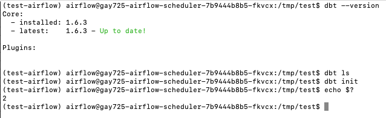

## Python dbt-core debugging

### Context: dbt does not respond to any of it's commands

Due to changes in environment variable handling on dbt-core side, a read-only `$DBT_PROJECT_DIR` led to dbt not responding to anything but the `--version` call.



All dbt commands returned [exit code 2](https://docs.getdbt.com/reference/exit-codes)

```
2	The dbt invocation completed with an unhandled error (eg. ctrl-c, network interruption, etc).
```

### Solution

Using dbt-core python library and it's `dbtRunner` gives us the possibility to receive that _"unhandled error"_

```python
>>> from dbt.cli.main import dbtRunner
>>> dbt_cli = dbtRunner()
>>> dbt_cli.invoke(["ls"])
dbtRunnerResult(success=False, exception=OSError(30, 'Read-only file system'), result=None)
```
