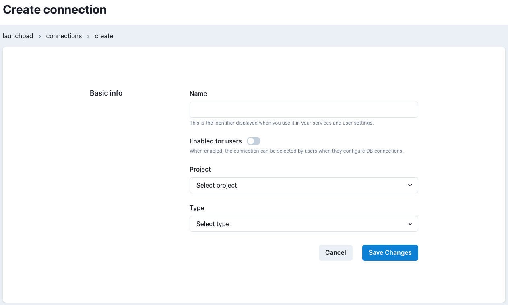

# Connections Admin

## Overview

A Connection in Datacoves defines the basic information for your data warehouse. It acts as a template that can then be used for user and service connections. This simplifies the onboarding process for users.

## Connection Templates Listing

On the Connections Template landing page you can see a list of Connections associated with each of your Datacoves projects.

For each connection we can see the provider (i.e. Snowflake, Redshift) and the number of service and user accounts associated with each template.

Each row contains 2 action buttons, Edit and Delete.

## Create/Edit Connection Template

To create a new connection template click the `Create Connection` button.

Each Connection Template consist of the following fields:
- **Name** This is the name users will see when selecting the base connection template when entering credentials for themselves or service accounts.
- **Enabled for users** This flag indicates whether this template will be available for users or only for service accounts. To simplify the end-user experience, it is best to show them only the primary template they should use when entering their credentials.
- **Project** This defines the Datacoves project that should be associated with this connection template
- **Type** Defines the data warehouse provider so that users are presented the appropriate fields when entering their credentials.
- **Provider connection details** Based on the Provider Type selected, available default parameters will be displayed.
    - For Snowflake, the available fields are: `Account`, `Warehouse`, `Database`, and `Role`
    
    - For Redshift, the available fields are:  `Host` and `Database`
    
