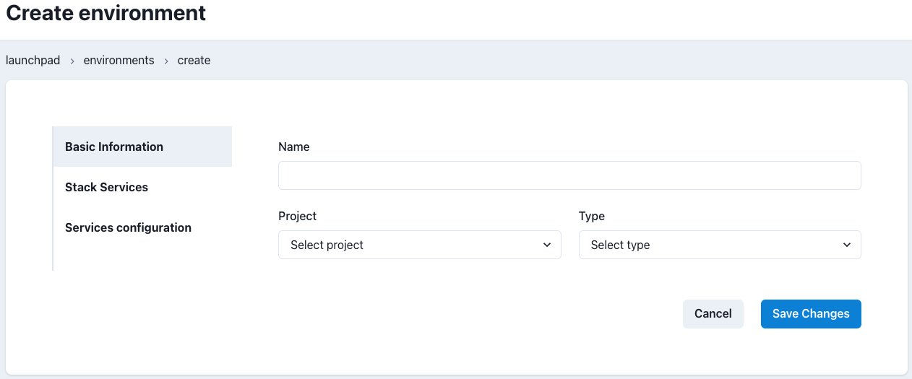
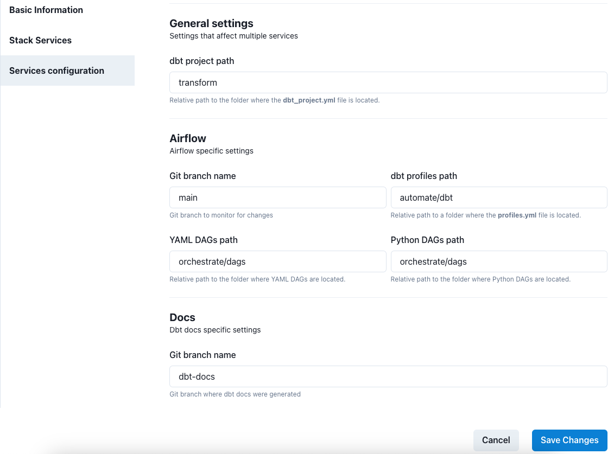

# Environments Admin

## Overview

An Environment in Datacoves defines a data stack and associated settings for a given project. These data stacks are isolated from each other and can be created for long term or temporary use to perform some tests such as to try out a new version of dbt with your project.

These environments are displayed on the launchpad to users that have the proper permission for the given environment.

## Environment Listing

On the Environments landing page you can see a list of environments associated with each of your Datacoves projects.

For each environment we can see the associated project, the name of the environment to be displayed on the landing page, and the number of associated service connections.

Each row contains 2 action buttons, Edit and Delete.

## Create/Edit Environment

To create a new environment click the `New Environment` button.

Environment Settings are separated into different tabs.

- **Basic information** This tab has the base information for the environment.

  - The `name` to be displayed on the launchpad
  - The `Project` the environment should be associated with
  - The `type` of environment (development, test or prod). It is best practice for users to perform their work in a development environment and production jobs to run in a production environment which is typically more governed.

- **Stack Services** Define which tools will be enabled for this environment. At least one service must be enabled. Available services include `LOAD (Airbyte)`,`TRANSFORM(dbt and VS Code)`, `OBSERVE(dbt docs)`, `ORCHESTRATE(Airflow)`, and `ANALYZE(Superset)`
  

- **Services Configuration** The services enabled for the environment may require additional configurations. This tab is where the services will be configured. For example: - TRANSFORM(dbt & VS Code) requires the path the location of the `dbt_project.yml` this allows you to either have the dbt project at the root of your git repository or in some sub-folder. - ORCHESTRATE(Airflow) requires: - **branch** Determines git branch to synchronize to Airflow. This allows you to have one branch like `airflow_development` for a development environment and use `main` on a production environment. - **dbt profiles path** The location where Airflow will find dbt profiles.yml file to use during a dbt run. - **YAML DAGs path** When using yml based Airflow DAGs Airflow will look for the yml files in this location. - **Python DAGs** This is the location Airflow will look for the DAG definition files - DBT DOCS Here we specify the branch that will be synchronized for produciton dbt docs. This branch must exist in your git repository.
  
