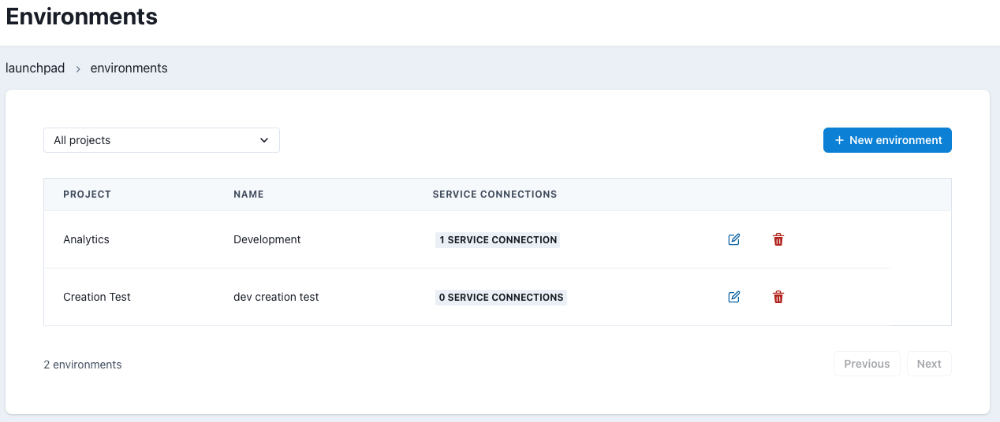

# Environments Admin

## Overview

An Environment in Datacoves defines a data stack and associated settings for a given project. These data stacks are isolated from each other and can be created for long term or temporary use to perform some tests such as to try out a new version of dbt with your project.

These environments are displayed on the launchpad to users that have the proper permission for the given environment.

>[!TIP]See our How To - [Environments](how-tos/datacoves/how_to_environments.md)

## Environment Listing

On the Environments landing page you can see a list of environments associated with each of your Datacoves projects.

For each environment we can see the associated project, the name of the environment to be displayed on the landing page, and the number of associated service connections.

Each row contains 2 action buttons, Edit and Delete.
