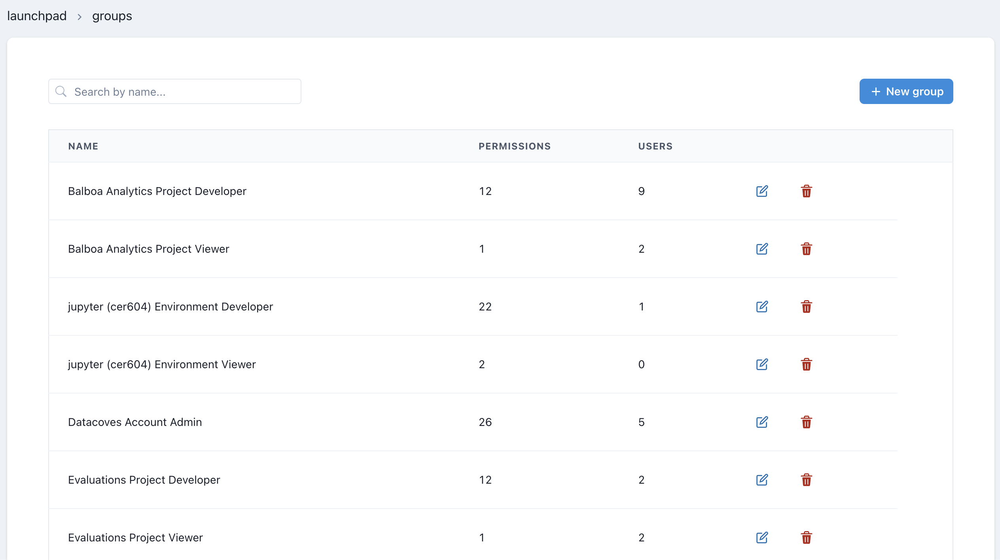

# Connection Templates Admin

## Overview

A Group in Datacoves is a collection of permissions, which can be assigned to your account's users.
By default, one group comes shipped with your account, the `Account Admin`. Also, when you create a [Project](/reference/admin-menu/projects.md) or an [Environment](/reference/admin-menu/environments.md), two groups are created for each of them: `Project/Environment Developer` and `Project/Environment Viewer`

## Groups Listing

On the Groups landing page you can see your account's list of groups

For each group we can see it's name, the amount of permissions it has enabled, and how many users are using it.

Each row contains 2 action buttons, Edit and Delete.

## Create/Edit Group

Each group consist of three main components:

- `Name`
- `Description` (to help identify what each group permits and restricts)
- A list of `Permissions`, which consist of single `read` and `write` authorizations, to help granulate the user experience as much as possible.

Apart from these main fields, you can specify a comma-separated list of `Active Directory groups`, as well as `Filter` the available permissions to enable/disable them with ease.

