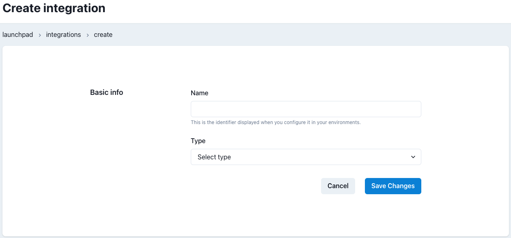

# Integrations Admin

## Overview

Integrations are used to configure external services such as Email, MS Teams and Slack notifications

For more information see:
- SMTP: used to [send email notifications from Airflow](/how-tos/airflow/send-emails.md)
- MS Teams: used to [send Microsoft Teams messages from Airflow](/how-tos/airflow/send-ms-teams-notifications.md)
- Slack: used to [send Slack messages from Airflow](/how-tos/airflow/send-slack-notifications.md)

## Integrations Listing

On the Integrations landing page you can see a list of integrations defined for your Datacoves account.

For each integration we can see the name of the integration and the integration type.

Each row contains 2 action buttons, Edit and Delete.

## Create/Edit Integration

To create a new integration click the `New Integration` button.

An Integration consists of the following fields:
- **Name** This is the identifier used to configure the integration within your environments.
- **Type** This is the type of integration such as `SMTP` and `MS Teams`.
Depending on the type of integration selected, additional fields will be displayed. For information on these fields, see the following pages:
    - SMTP -> [send email notifications from Airflow](/how-tos/airflow/send-emails.md)
    - MS Teams -> [send Microsoft Teams messages from Airflow](/how-tos/airflow/send-ms-teams-notifications.md)
    - Slack: -> [send Slack messages from Airflow](/how-tos/airflow/send-slack-notifications.md)
