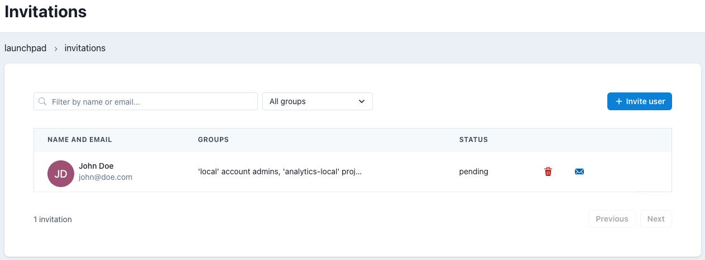

# Invitations Menu

## Concept

<!-- TODO: Get a proper well-writen concept of what a Project in Datacoves is -->
As stated in [Users Menu](/reference/admin-menu/users.md) article, users are invited to your account, not created.

## Landing

This landing page lists all invitations your account has sent, both completed and pending. The most important here are it's two action buttons: `delete` which cancels an invitation, leaving it's e-mail without effect; and `resend`.

## Invite someone

Creating an Invitation requires the completion of these fields: `Name`, `Email`, `Groups`

While in [Users](/reference/admin-menu/users.md) article we mentioned users can't be created and must instead be invited, you can't edit an invitation: once you invited someone to join your account with certain permission groups, the only thing that can be done is waiting for that user to accept the invitation, and finally editing their permission groups from the [Users menu](/reference/admin-menu/users.md) 

