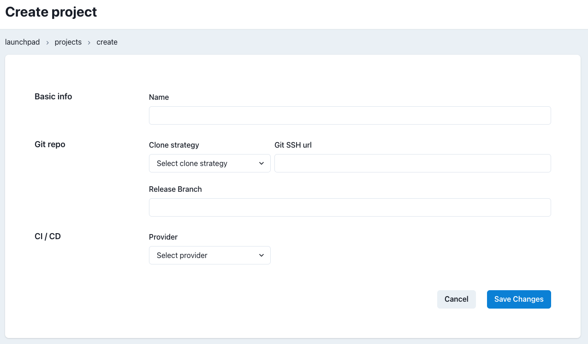

# Projects Menu

## Concept

A Project is the highest grouping concept in Datacoves. It is what contains environments, which then are linked to services, connections, etc.

Your `Launch Pad` (Datacoves' landing page) shows you this hierachy in a clear way:

## Landing

In the landing page of Projects' menu, you can see a list of Projects linked to your account. In each of them, the amount of linked connections and envrionments and, most importantly, git status (tested or not)

On the right side of each row, 3 action buttons are displayed: Test, Edit and Delete.

### Testing connection

Testing your repo connection is what defines the availability of your different stack services: you may have configured (i.e.) Airflow successfuly, but if your Project has never been tested, ORCHESTRATE will not be ready for you to use.

## Create/Edit Project

Each Project consist of the following fields:
- Name
- Git Repo
    - Clone strategy: preferred method of connecting to the Repo. Depending on selection, each strategy requires different information:
        - SSH: if selected, a `SSH Key` will be automatically generated for you to configure in your git provider.
        
        - HTTPS: if selected, new input fields `Git HTTPS url`, `Username` and `Password` will appear, needed to connect to the repo via HTTPS
        
    - Release branch: branch used by Datacoves
- CI/CD Provider: if used in your Repo, here you can choose your provider and specify your `jobs home url`

