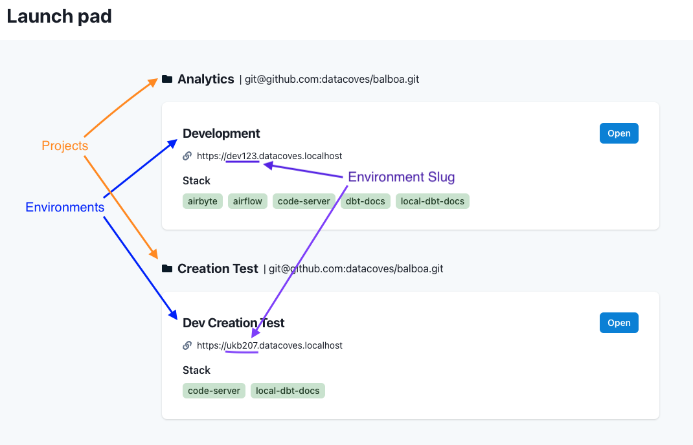

# Projects Admin

## Overview

A Project is the highest grouping in Datacoves. It is what contains environments, which then are linked to services, connections, etc.

The Datacoves landing page (Launch Pad) follows this hierarchy:

>[!TIP]See our How To - [Projects](how-tos/datacoves/how_to_projects.md)

## Projects Listing

On the Projects landing page you can see a list of projects associated with your Datacoves account.

For each project, you will see number of defined connection templates and environments. You will also see the status of the git connection(tested or not).

Each row contains 3 action buttons, Test, Edit and Delete.

### Testing connection

Testing your repo connection ensures that services like dbt docs and Orchestration are available. It is important to test the connection to git to make sure the system can clone your repository. If the test fails, this indicates that Datacoves cannot clone your repository this will affect serving production dbt docs and Airflow jobs. Edit your environment and check your settings then click the test button again to assure the git status is "Tested".
