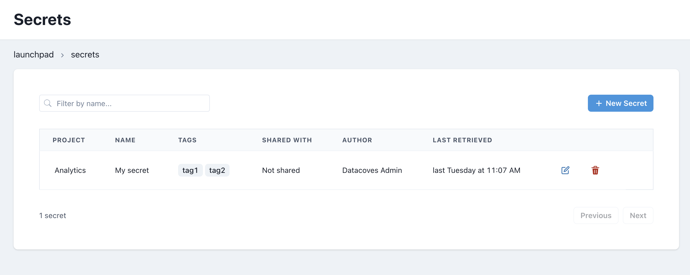

# Secrets Admin

## Overview

Secrets are used to manage confidential information that are used by tools running in VSCode, or services like Airflow.

Some uses could be:

- Storing Airbyte connections credentials using `dbt-coves extract` and `dbt-coves load` commands.
- Storing Airflow connections or variables used by Airflow DAGs

>[!TIP]See our How To - [Secrets](how-tos/datacoves/how_to_secrets.md) 

## Secrets Listing

On the Secrets landing page you can see a list of secrets defined for your Datacoves account. Each secret belongs to a project, has a name, tags, and an author.

### Sharing secrets

When a new secret is created, it can be shared across the entire project, or shared with just one environment. It could also be treated as a personal secret when it's shared with no environment/project. In such case, only the author can retrieve it's value.

### Secrets store

Secrets could be stored encrypted on the Datacoves database, or use a third party service, such as Amazon Secrets Manager, among others.