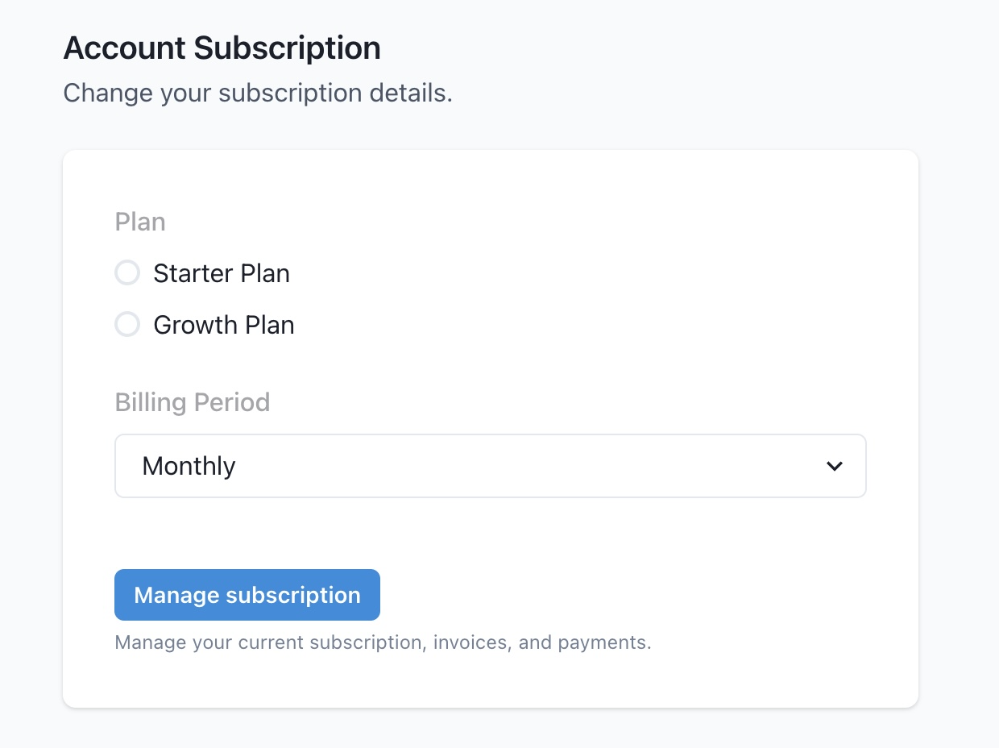

# Account Settings & Billing

## Overview

This page is where you adjust all your account level settings such as the account owner, your subscription type and billing options. Here you can also delete your Datacoves account.

## Account Settings

This page is divided into three main sections:

1. `Account Settings`, where you can change your account `name` which is displayed to the right of the Datacoves logo.

  

2. `Account Subscription` is where you manage your subscription plan and billing period. managing invoices and payments.

  The `Manage Subscription` button will take you to Stripe where you can see invoices and payments.

  

3. The `Danger Zone` section is where you can delete your account and associated data.

  
