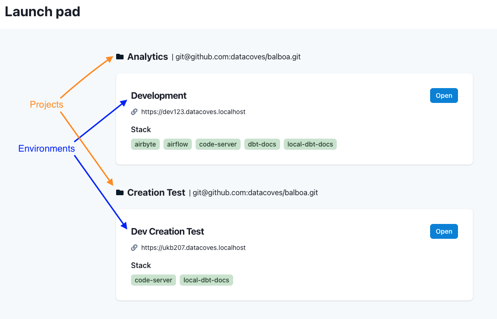

# Airflow Config Defaults

For security reasons, we do not expose the Airflow config to end users via the `Airflow *Admin -> Configuration` menu option. 

Below are some of the configs that we use which you may find useful:

```
[celery]
worker_concurrency = 16
worker_prefetch_multiplier = 1
operation_timeout = 1.0
task_adoption_timeout = 600
stalled_task_timeout = 0
task_publish_max_retries = 3

[celery_kubernetes_executor]
kubernetes_queue = kubernetes
```
```
[core]
executor = KubernetesExecutor
default_timezone = utc
parallelism = 32
max_active_tasks_per_dag = 16
dags_are_paused_at_creation = True
max_active_runs_per_dag = 16
dagbag_import_timeout = 300
dag_file_processor_timeout = 180
task_runner = StandardTaskRunner
killed_task_cleanup_time = 60
default_task_retries = 2
```
```
[database]
max_db_retries = 3
```
```
[email]
default_email_on_retry = True
default_email_on_failure = True
```
```
[kubernetes]
worker_pods_pending_timeout = 600
worker_pods_pending_timeout_check_interval = 120
worker_pods_queued_check_interval = 60
worker_pods_pending_timeout_batch_size = 100

[kubernetes_environment_variables]
AIRFLOW__CORE__DEFAULT_TASK_RETRIES = 2
AIRFLOW__CORE__DAGBAG_IMPORT_TIMEOUT = 300
AIRFLOW__SCHEDULER__MIN_FILE_PROCESS_INTERVAL = 180
AIRFLOW__CORE__DAG_FILE_PROCESSOR_TIMEOUT = 180
AIRFLOW__KUBERNETES__WORKER_PODS_PENDING_TIMEOUT = 600
AIRFLOW__SCHEDULER__PARSING_PROCESSES = 1
AIRFLOW__SCHEDULER__MAX_DAGRUNS_PER_LOOP_TO_SCHEDULE = 20
```
```
[scheduler]
run_duration = 41460
job_heartbeat_sec = 5
scheduler_heartbeat_sec = 5
num_runs = -1
scheduler_idle_sleep_time = 1
min_file_process_interval = 180
deactivate_stale_dags_interval = 60
dag_dir_list_interval = 300
print_stats_interval = 30
pool_metrics_interval = 5.0
scheduler_health_check_threshold = 30
orphaned_tasks_check_interval = 300.0
scheduler_zombie_task_threshold = 300
zombie_detection_interval = 10.0
parsing_processes = 1
trigger_timeout_check_interval = 15
run_duration = 41460
```
```
[sensors]
default_timeout = 604800
```
```
[smtp]
smtp_timeout = 30
smtp_retry_limit = 5
```
```
[webserver]
default_ui_timezone = utc
worker_refresh_interval = 6000
log_fetch_timeout_sec = 5
log_fetch_delay_sec = 2
log_auto_tailing_offset = 30
default_dag_run_display_number = 25
auto_refresh_interval = 3
```
# Airflow Environment Variables

Datacoves injects environment variables into Airflow.

**DATACOVES__DAGS_FOLDER**: The folder where Airflow will look for DAGs. This is defined when you set your `python DAGs path` in the [environment setup](how-tos/datacoves/how_to_environments.md#services-configuration).

**DATACOVES__ENVIRONMENT_SLUG**: The slug for your environment. This is randomly generated upon creation of the environment.

**The development slug can be seen on the launchpad screen:**

`https://dev123.datacoves.localhost` in this case `DATACOVES__ENVIRONMENT_SLUG=dev123`




>[!NOTE]If you have any questions, please send us an email at support@datacoves.com
