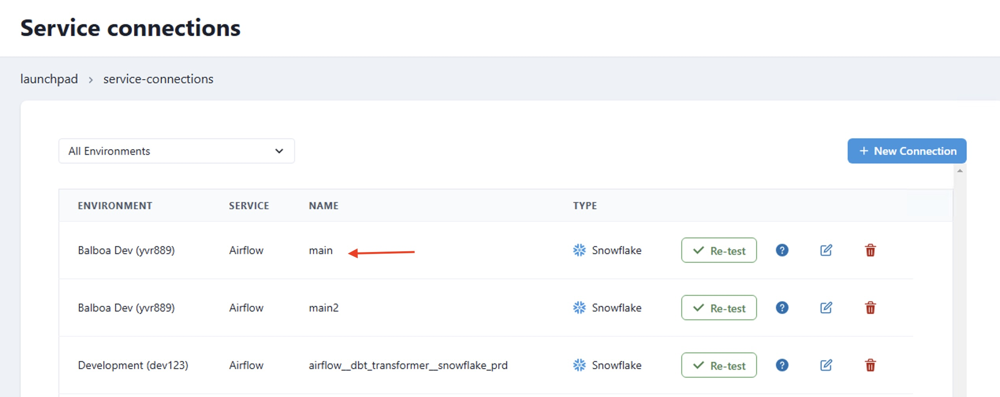

# Datacoves Airflow Decorators

With the introduction of the task flow API in Airflow we have released the Datacoves decorators to make writing DAGs simple! 

>[!NOTE] While the Datacoves decorators are recommended, the [Datacoves Operators](/reference/airflow/datacoves-operator.md), are still supported. 

## Decorators 

### @task.datacoves_bash

This custom decorator is an extension of Airflow's default @task decorator and should be used to run bash commands, pull secrets etc.  

**The operator does the following:**

- Copies the entire Datacoves repo to a temporary directory, to avoid read-only errors when running `bash_command`.
- Activates the Datacoves Airflow virtualenv.
- Runs the command in the repository root (or a passed `cwd`, relative path from repo root where to run command from).

**Params:**

- `env`: Pass in a dictionary of variables. eg) `"my_var": "{{ var.value.my_var }}"` Please use {{ var.value.my_var }} syntax to avoid parsing every 30 seconds.
- `outlets`: Used to connect a task to an object in datahub or update a dataset
- `append_env`: Add env vars to existing ones like `DATACOVES__DBT_HOME`
  
```python
def my_bash_dag():
    @task.datacoves_bash
    def echo_hello_world() -> str:
        return "Hello World!"
dag = my_bash_dag()
```


### @task.datacoves_dbt

This custom decorator is an extension of the @task decorator and simplifies running dbt commands within Airflow. 

**The operator does the following:**

- Copies the entire Datacoves repo to a temporary directory, to avoid read-only errors when running `bash_command`.
- It always activates the Datacoves Airflow virtualenv.
- If 'dbt_packages' isn't found, it'll run `dbt deps` before the desired command
- It runs dbt commands inside the dbt Project Root, not the Repository root.

**Params:**
- `connection_id`: This is the [service connection](/how-tos/datacoves/how_to_service_connections.md) which is automatically added to airflow if you select `Airflow Connection` as the `Delivery Mode`.
- `overrides`: Pass in a dictionary with override parameters such as warehouse, role, or database.

```python
def my_dbt_dag():
    @task.datacoves_dbt(
      connection_id="main"
    )
    def dbt_test() -> str:
        return "dbt debug"

dag = my_dbt_dag()
```

Example with overrides.

```python
def my_dbt_dag():
    @task.datacoves_dbt(
        connection_id="main",
        overrides={"warehouse": "my_custom_wh"})
    def dbt_test() -> str:
        return "dbt debug"

dag = my_dbt_dag()
```

The examples above use the Airflow connection `main` which is added automatically from the Datacoves Service Connection


#### Uploading and downloading dbt results

From Datacoves 3.4 onwards, the `datacoves_dbt` decorator allows users to upload and download dbt execution results and metadata to our `dbt API`

>[!NOTE] Dbt API is a feature that is not enabled by default. Please contact support for further assistance.

This is particularly useful for performing [dbt retries](/how-tos/airflow/retry-dbt-tasks.md).


The new datacoves_dbt parameters are:

- `dbt_api_enabled` (Default: `False`): Whether your Environment includes a dbt API instance.
- `download_static_artifacts` (Default: `True`): Whether user wants to download dbt static artifact files.
- `upload_static_artifacts` (Default: `False`): Whether user wants to upload dbt static files.
- `download_additional_files` (Default: `[]`): A list of extra paths the user wants to download.
- `upload_additional_files` (Default: `[]`): A list of extra paths the user wants to upload.
- `upload_tag` (Default: DAG `run_id`): The tag/label the files will be uploaded with.
- `upload_run_results` (Default: `True`): Whether the `run_results.json` dbt file will be uploaded.
- `download_run_results` (Default: `False`): Whether the `run_results.json` dbt file will be downloaded.
- `upload_sources_json` (Default: `True`): Whether the `sources.json` dbt file will be uploaded.
- `download_sources_json` (Default: `False`): Whether the `sources.json` dbt file will be downloaded.

>[!NOTE]
>**Static Artifacts**  
>The static artifacts are important dbt-generated files that help with dbt's operations:
>
>- `target/graph_summary.json`: Contains a summary of the DAG structure of your dbt project.
>- `target/graph.gpickle`: A serialized Python networkx graph object representing your dbt project's dependency graph.
>- `target/partial_parse.msgpack`: Used by dbt to speed up subsequent runs by storing parsed information.
>- `target/semantic_manifest.json`: Contains semantic information about your dbt project.
>
>These files are downloaded by default (when `download_static_artifacts=True`) and are tagged as "latest" when uploaded.

### @task.datacoves_airflow_db_sync

>[!NOTE] The following Airflow tables are synced by default: ab_permission, ab_role, ab_user, dag, dag_run, dag_tag, import_error, job, task_fail, task_instance. 

**Params:**

- `db_type`: The data warehouse you are using. Currently supports `redshift` or `snowflake`.
- `destination_schema`: The destination schema where the Airflow tables will end-up. By default, the schema will be named as follows: `airflow-{datacoves environment slug}` for example `airflow-qwe123`.
- `connection_id`: The name of your Airflow [service connection](/how-tos/datacoves/how_to_service_connections.md) which is automatically added to airflow if you select `Airflow Connection` as the `Delivery Mode`. 
- `additional_tables`: A list of additional tables you would want to add to the default set.
- `tables`: A list of tables to override the default ones from above. Warning: An empty list [] will perform a full-database sync.

```python
def airflow_data_sync():
    @task.datacoves_airflow_db_sync(
        db_type="snowflake",
        destination_schema="airflow_dev", 
        connection_id="load_airflow",
        # additional_tables=["additional_table_1", "additional_table_2"]
    )

dag = airflow_data_sync()
```
