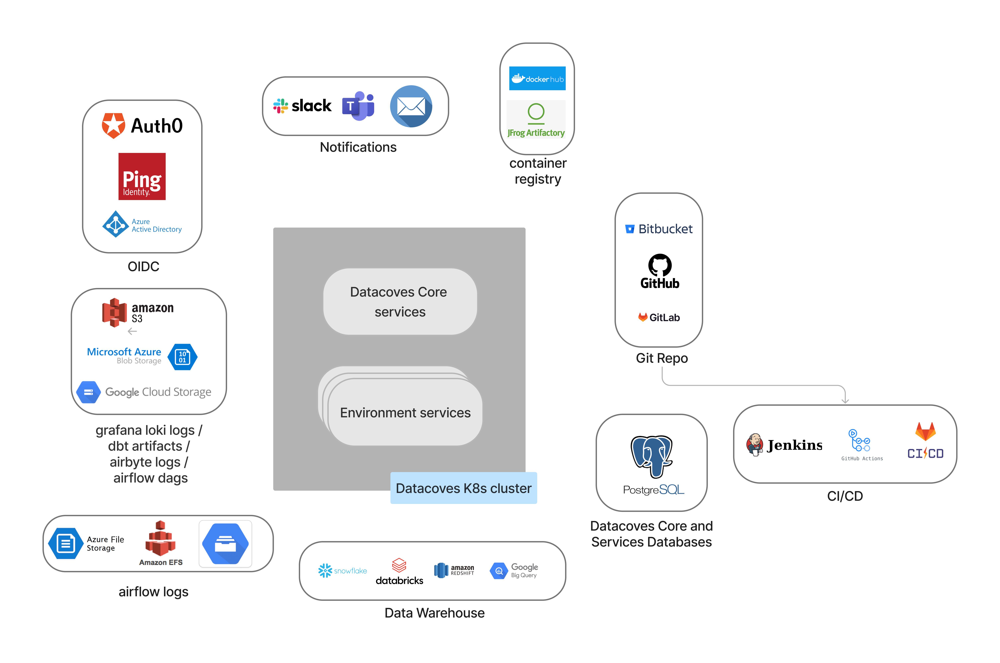

# VPC Deployment

Datacoves is designed to work on Public or Private Virtual Clouds.
The following diagram shows the main services required by Datacoves when deployed on a VPC.

## Datacoves Architecture

## Dependencies

Datacoves can be deployed on AWS, Azure or Google Cloud.

Here is the list of services required, each cloud provider offers the service with a different name/brand.

| Service      |  Purpose        |  Requirements    |   Quantity |
|--------------|-----------------|--------------------------|------------|
| Database | Datacoves core services | PostgreSQL > v.14, Minimum 2vcpu, 16Gb memory __(*)__ | 1 server |
| Database | Datacoves stack services | PostgreSQL > v.14, Minimum 4vcpu, 32Gb memory __(*)__ | 1 server |
| Blob storage |  DBT artifacts  |  N/A                     | 1 bucket         |
| Blob storage |  Grafana logs   |  Lifetime policy with 30 days retention                     | 1 bucket         |
| Blob storage |  Airflow DAGs   |  N/A  | 1 bucket per Airflow instance         |
| Blob storage |  Airbyte logs   |  N/A  | 1 bucket per Airbyte instance         |
| File storage |  Airflow logs   |  Sub-millisecond first byte read latency  | 1 file system per Airflow instance         |
| OIDC provider | Datacoves SSO | Oauth 2.0 OIDC compliant provider | 1 provider |
| Git server | DBT development version control | > v2.33 | 1 server |
| CI/CD server |  DBT development |  N/A                     | 1 server         |

__(*)__ min. requirements may vary depending on the number of environments

### Optional dependencies

| Service      |  Purpose        |  Requirements    |   Quantity |
|--------------|-----------------|--------------------------|------------|
| Docker Registry |  Docker images registry  |  Any docker API compliant image registry  | 1 service account |
| SMTP account |  Airflow notifications  |  N/A                     | 1 service account         |
| Slack account |  Airflow notifications  |  N/A                     | 1 account         |
| MS Teams account |  Airflow notifications  |  N/A                     | 1 account         |

