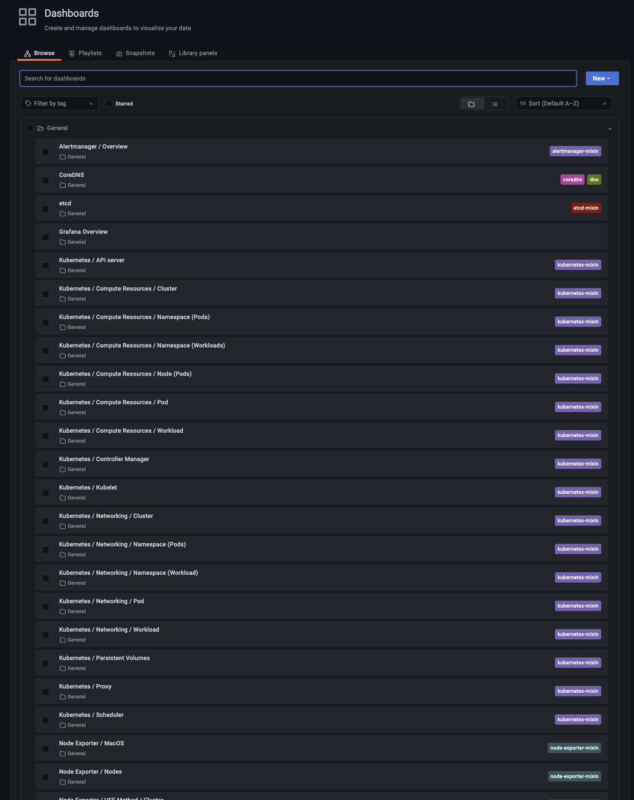

# Grafana Dashboards

## Navigation menu

Accessing the dashboards list is easy:

>[!TIP]We recommend you bookmark your favorite dashboards so they are pinned in the home page.

## Prebuilt dashboards

Grafana comes with a set of prebuilt dashboards that you can use right away.

!> The following dashboards are not working quite right yet, so please don't use them:  
. etcd  
. Kubernetes / Compute Resources / Namespace (Workloads)  
. Kubernetes / Compute Resources / Node (Pods)  
. Kubernetes / Compute Resources / Workload  
. Kubernetes / Controller Manager  
. Kubernetes / Proxy  
. Kubernetes / Scheduler  
. Node Exporter / (all)
