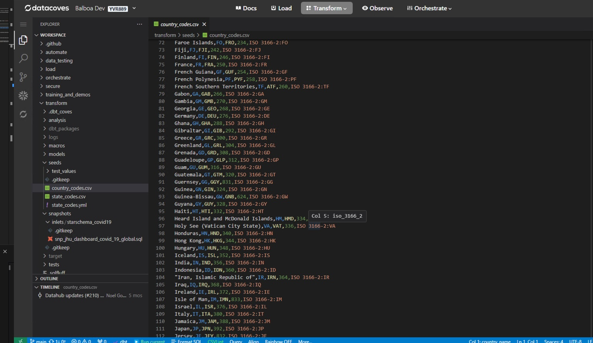
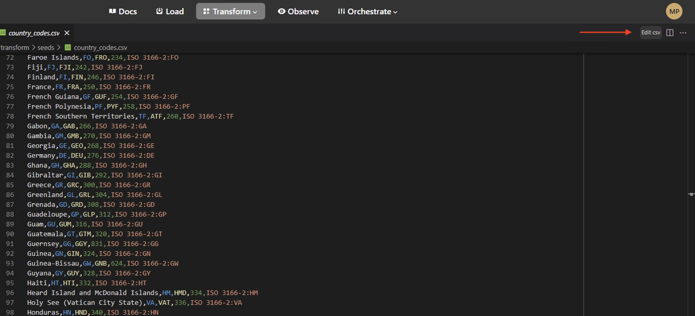
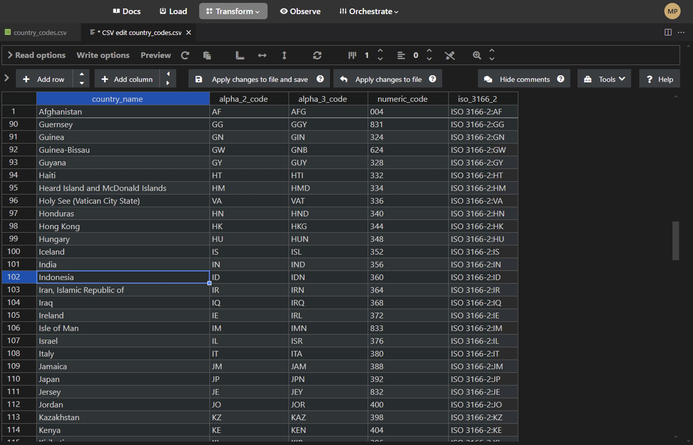

# CSVs in VS Code

This page is all about working with CSV files in Datacoves' VS Code in the browser. 

## Features

### Rainbow CSV

 Rainbow CSV comes installed by default to bring color to your CSV files, making it more human readable. 

### Editing CSVs
Editing CSVs is made simple with the `Edit CSV` option. 

This will open up the CSV editor seen below.

### Autosave
Unlike the rest of VS Code in the browser experience which makes use of Autosave. When editing CSVs you must always save using `CMD/CTRL + S` or use the `Apply changes to file and save` button.
