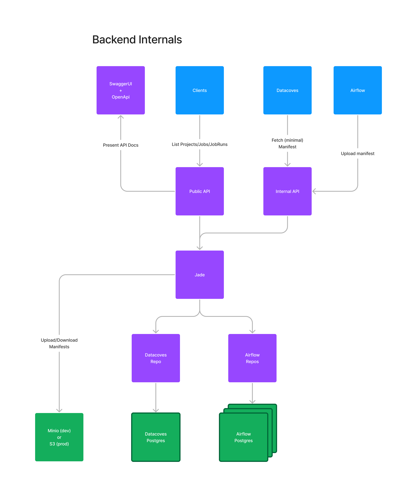

# Jade ([Cove](https://en.wikipedia.org/wiki/Jade_Cove))

An Elixir Backend that provides a public API for Datacoves' clients.

## Design Overview

[Walkthrough Video](https://www.loom.com/share/dcaa2c3c5d4248e3b8c30b3fcfe7c79c)

[Figma Link](https://www.figma.com/file/zOD6fT1iO5KLwrdbM5j7Te/Datacoves---dbt-Backend?type=whiteboard&node-id=22-146&t=L4lybp69AysuEXyR-4)



## Setup

### Install Elixir and erlang

If you haven't already, you need to install Elixir and erlang on your machine. The easiest way is to use a version manager like [asdf](https://asdf-vm.com/). However, there are plenty of other ways explained [here](https://elixir-lang.org/install.html).

To install `asdf`, please follow [this](https://asdf-vm.com/guide/getting-started.html) guide.

To install Elixir and erlang using `asdf`, first open a shell in the project path and simply run `asdf install`. That will install the Elixir and erlang version as specified in the `.tool-versions` file. And that's it! 🚀

## Developing inside k8s

This guide explains how to develop the project as a pod inside the Kubernetes cluster. This way of developing is preferred because our development and production environment is the same.

### Symlinking this Repo to Datacoves

First, we need to symlink this repository to the datacoves project so that we can hot-reload its code inside the k8s pod.

To create the symlink, simply run `ln -s . ../datacoves/src/core/dbt-api`. Update the command with a path to your local datacoves folder.

Now, you should see this repository as a folder in `src/core/dbt-api`. If not, delete whatever you see in `src/core/dbt-api` and run the command again.

### Enabling Jade in the k8s cluster

Inside the Datacoves project, go to the file `config/datacoveslocal.com/cluster-params.yaml` and enable the following flags:

```
local_dbt_api_volume: true
enable_dbt_api: true
expose_dbt_api: true
```

Then, run `./cli.py install`. This will create the `dbt-api-svc` service and `dbt-api` pod and expose the pod at [https://dbt.datacoveslocal.com](https://dbt.datacoveslocal.com).

It will also mount the `src/core/dbt-api` folder into the k8s pod. So, whenever you change the code here, it will change in the k8s pod as well.

### Configure Storage

You can configure `dbt-api` to store all files in either `minio`, `s3`, or `(azure) blob`.

#### Configure Minio

To use Minio, you need to set the following environment variables:

```
STORAGE_ADAPTER="minio"
MINIO_BUCKET_NAME="fill-in"
MINIO_URL="fill-in"
MINIO_ACCESS_KEY="fill-in"
MINIO_SECRET_KEY="fill-in"
```

#### Configure S3

To use S3, you need to set the following environment variables:

```
STORAGE_ADAPTER="s3"
S3_BUCKET_NAME="fill-in"
S3_ACCESS_KEY="fill-in"
S3_SECRET_ACCESS_KEY="fill-in"
S3_REGION="fill-in"
```

#### Configure (Azure) Blob

To use Blob, you need to set the following environment variables:

```
STORAGE_ADAPTER="blob"
BLOB_CONTAINER="fill-in"

# Either define a connection string
BLOB_STORAGE_ACCOUNT_CONNECTION_STRING="fill-in"

# Or define the account name and key.
# These are ignored if a connection string is present.
BLOB_STORAGE_ACCOUNT_NAME="fill-in"
BLOB_STORAGE_ACCOUNT_KEY="fill-in"
```

### Run a development server in k8s

Next, you need to run a development webserver inside the k8s pod. From inside the datacoves repo, run `./cli.py pod_sh dbt-api`.

Then, wait until you see a shell. You now have a shell inside the k8s pod. Now, run `./run.sh dev` and a development webserver will start.

**This webserver does not start the Endpoint** because port 80 is already occupied by the Jade instance that is started automatically by the pod. So, if you need to test HTTP requests to the Jade API, run `./run.sh shell`. This will create an IEx session inside your running production Jade instance. To update its code, simply copy&paste the module that you want to update into the IEx session and hit `Enter`. This will update the code running in the production instance and when you make the next HTTP request, that code will be used.

## Developing Locally

**Not recommended**: Developing the project as a pod inside the Kubernetes cluster is preferred.

The next section explains how you can develop Jade locally, that is without running it inside the Kubernetes cluster as a pod.

### Expose the Kubernetes Postgres Pod to Localhost

You need to connect to the Postgres pod that runs in the Kubernetes cluster to get the data from the Datacoves database and to create and use the Postgres database for this project.

Make sure that the Datacoves Kubernetes cluster is up-and-running on your local machine.

Check that the Postgres pod is running with:

```
> kubectl get pods -n core
NAME                         READY   STATUS    RESTARTS      AGE
api-64d9c4776-9jw7l          1/1     Running   0             87m
beat-6bb9b8c69c-kshcm        1/1     Running   1 (67m ago)   87m
flower-59bcb596f8-cmmt9      1/1     Running   0             87m
postgres-postgresql-0        1/1     Running   0             8m16s # <- Check that this has 1/1 pods
redis-master-0               1/1     Running   0             87m
workbench-6b84984976-cjmb9   1/1     Running   0             87m
worker-68d8bff495-52pj4      1/1     Running   0             87m
```

Now, expose the Postgres pod to `localhost:5432` with this command:

```
kubectl port-forward --namespace core svc/postgres-postgresql 5432:5432
```

This will start the port forwarding. You can stop it later with `CTRL + C`.

If you're having trouble with the command above, check that you use the correct service name. Here, we use the service name `svc/postgres-postgresql`, but it might different. To find the correct service name, run this command:

```
> kubectl get services -n core
NAME                     TYPE        CLUSTER-IP      EXTERNAL-IP   PORT(S)    AGE
core-api-svc             ClusterIP   10.96.69.6      <none>        80/TCP     88m
core-flower-svc          ClusterIP   10.96.245.62    <none>        80/TCP     88m
core-workbench-svc       ClusterIP   10.96.17.243    <none>        80/TCP     88m
postgres-postgresql      ClusterIP   10.96.238.115   <none>        5432/TCP   88m # <- You'll need this NAME here
postgres-postgresql-hl   ClusterIP   None            <none>        5432/TCP   88m
redis-headless           ClusterIP   None            <none>        6379/TCP   88m
redis-master             ClusterIP   10.96.123.67    <none>        6379/TCP   88m
```

You'll see that a service called `postgres-postgresql` is running. That's the name you should use in the `port-forward` command above, but don't forget to prefix it with `svc/SERVICE_NAME_HERE`.

### Expose Airflow's Postgres Database to Localhost

As of now, we fetch Airflow's data directly from its Database instead of through the API because this allows us to e.g. join different tables and offer faster query times. If you start this project locally, you need to expose the Airflow database to localhost. Here's how:

#### Start Airflow as Superuser.

1. Log into [api.datacoveslocal.com](https://api.datacoveslocal.com) and navigate to your User under `Users`.
2. Assign all available groups to yourself under the `Groups` section. Don't forget to hit `Save`!
3. Navigate to [datacoveslocal.com](https://datacoveslocal.com)
4. Go to `Account Administration` (small gear at the top right) -> `Environments` -> `Edit` on first entry -> `Stack Services`
5. Here make sure that the `Orchestrate` toggle is `ON`. Don't forget to hit `Save Changes`.
6. Now, you should see a few `Airflow`-pods when running `kubectl get pods --all-namespaces`.
7. Wait a minute and then go to `Account Administration` -> `Service Connections`.
8. Here, click the little lightning symbol `Test Connection`. This will test the Airflow connection.
9. Once the Airflow Connection is established successfully, the status in that row should change to `tested`.
10. Now, Airflow is running!

#### Expose the Airflow Postgres to Localhost

1. In a new terminal, run `kubectl port-forward --namespace dcw-dev123 svc/dev123-airflow-postgresql 5433:5432`
   1. Make sure that the namespace and service names match what you see when you run `kubectl get services --all-namespaces`
2. This will expose the Airflow database at `localhost:5433` (note this is not the standard `5432` port because that's where the Datacoves Postgres is already running)

## Accessing the API

### Start the Server

To start your Phoenix server:

- Run `mix setup` to install and setup dependencies
- Start Phoenix endpoint with `mix phx.server` or inside IEx with `iex -S mix phx.server`

Now, the server should be running at `http://localhost:4000`.

### Make Requests

The easiest way to make requests is to install [Insomnia](https://insomnia.rest/) and to import the `requests.json` file from `./insomnia/requests.json`. That will import all endpoints and environment variables that you need.

Otherwise, you can make requests to the following routes:

```
# DBT API Clone
GET     /api/v2/accounts/:account_id                                       JadeWeb.API.V2.AccountController :show
GET     /api/v2/accounts/:account_id/projects                              JadeWeb.API.V2.ProjectController :index
GET     /api/v2/accounts/:account_id/projects/:id                          JadeWeb.API.V2.ProjectController :show
GET     /api/v2/accounts/:account_id/projects/:project_id/latest-run       JadeWeb.API.V2.Project.LatestJobRunController :show
GET     /api/v2/accounts/:account_id/environments                          JadeWeb.API.V2.EnvironmentController :index
GET     /api/v2/accounts/:account_id/environments/:id                      JadeWeb.API.V2.EnvironmentController :show
GET     /api/v2/accounts/:account_id/jobs                                  JadeWeb.API.V2.JobController :index
GET     /api/v2/accounts/:account_id/jobs/:id                              JadeWeb.API.V2.JobController :show
GET     /api/v2/accounts/:account_id/runs                                  JadeWeb.API.V2.JobRunController :index
GET     /api/v2/accounts/:account_id/runs/:id                              JadeWeb.API.V2.JobRunController :show
GET     /api/v2/accounts/:account_id/runs/:job_run_id/artifacts/:artifact  JadeWeb.API.V2.ManifestController :show

# Datacoves API
GET     /api/v2/datacoves/manifests                                        JadeWeb.API.Datacoves.ManifestController :show
  Parameters:
  Either to get the manifest for a specific DAG:
    dag_id={dag_id} (e.g. "yaml_sample_dag")
    environment_slug={e.g. "dev123"}

  Or to get the latest manifest for an environment:
    environment_slug="e.g. dev123"

POST    /api/v2/datacoves/manifests                                        JadeWeb.API.Datacoves.ManifestController :create
  Parameters:
  file={file_binary}
  run_id={dag_run_id} (e.g. "manual__2023-12-02T09:49:46.105347+00:00")
  environment_slug={e.g. "dev123"}
  (optional) trimmed="false" for fetching the full manifest

GET     /api/v2/datacoves/environments/:environment_slug/files             JadeWeb.API.Datacoves.FileController :show
POST    /api/v2/datacoves/environments/:environment_slug/files             JadeWeb.API.Datacoves.FileController :create
PATCH   /api/v2/datacoves/environments/:environment_slug/files             JadeWeb.API.Datacoves.FileController :update
PUT     /api/v2/datacoves/environments/:environment_slug/files             JadeWeb.API.Datacoves.FileController :update
DELETE  /api/v2/datacoves/environments/:environment_slug/files             JadeWeb.API.Datacoves.FileController :delete
GET     /api/v2/datacoves/projects/:project_slug/latest-manifest           JadeWeb.API.Datacoves.ProjectManifestController :show
  Parameters:
  (optional) trimmed="false" for fetching the full manifest

# OpenApi Specs Endpoint
GET     /api/v2/openapi                                                    OpenApiSpex.Plug.RenderSpec []
GET     /api/v2/swaggerui                                                  OpenApiSpex.Plug.SwaggerUI [path: "/api/v2/openapi"]

# Heathcheck endpoint for monitoring
GET     /api/v2/healthcheck                                                JadeWeb.API.Datacoves.HealthcheckController :show

# Legacy endpoints for "internal" calls. Will be removed once we migrated all calls to /api/v2/datacoves
GET     /api/internal/manifests                                            JadeWeb.API.Datacoves.ManifestController :show
POST    /api/internal/manifests                                            JadeWeb.API.Datacoves.ManifestController :create
GET     /api/internal/environments/:environment_slug/files                 JadeWeb.API.Datacoves.FileController :show
POST    /api/internal/environments/:environment_slug/files                 JadeWeb.API.Datacoves.FileController :create
PATCH   /api/internal/environments/:environment_slug/files                 JadeWeb.API.Datacoves.FileController :update
PUT     /api/internal/environments/:environment_slug/files                 JadeWeb.API.Datacoves.FileController :update
DELETE  /api/internal/environments/:environment_slug/files                 JadeWeb.API.Datacoves.FileController :delete
GET     /api/internal/projects/:project_slug/latest-manifest               JadeWeb.API.Datacoves.ProjectManifestController :show
GET     /api/internal/healthcheck                                          JadeWeb.API.Datacoves.HealthcheckController :show
```

### Authenticate Requests

All API endpoints (except OpenApi Specs and Healthcheck) are protected through a `Bearer Token` Authorization header.

You can get the API Token from the Datacoves dashboard and provide it with the `Authorization` header, like this:

```
Authorization: Token {api_key}
```

You can now make requests to any endpoint, for example:

```
GET     /api/v2/accounts/1/projects
RESPONSE BODY
{
  "data": [
    {
      "id": 54,
      "name": "Fake Project 879",
      "url": "http://api.datacoves.com/accounts/1/projects/1",
      "account_id": 1,
      "updated_at": 1697906147,
      "company_id": 126,
      "created_at": 1697906147,
      "integration_entity_id": "671",
      "integration_id": 94,
      "is_favorite": false,
      "job_count": 409,
      "workspace_id": 799
    }
  ]
}
```

If you try to make requests to a path with another `account_id`, you'll get an error:

```
GET /api/v2/accounts/2/projects
RESPONSE BODY
{
  "errors": {
    "message": "Invalid Account in Path. You have no accces to this account."
  }
}
```

### Using OpenAPI Specs

The application offers [OpenAPI](https://www.openapis.org/) specifications in two forms:

1. as `JSON` file at: [/api/v2/openapi](http://localhost:4000/api/v2/openapi)
2. as `SwaggerUI` at: [/api/v2/swaggerui](http://localhost:4000/api/v2/swaggerui)

You can test requests through the SwaggerUI by adding the client's `bearer token` through the `Authorize` button at the top right of the UI. After you added the token, you can execute the requests below.

## Tests

You can run all tests with the command: `mix test`.

If you ever need to reset your test database, simply run: `MIX_ENV=test mix ecto.reset`

Likewise, to reset your dev database, run: `mix ecto.reset` without the `MIX_ENV=test` prefix.

## Docker

To build a Docker image from the local project, run `docker compose build`

If you want to re-build the docker image without any cached values, run `docker compose build --no-cache`

To start the Docker image, run `docker compose up jade`

To start both the Elixir Backend and Postgres, run `docker compose up`.
If you want to run the containers in the background, run `docker compose up -d`.
